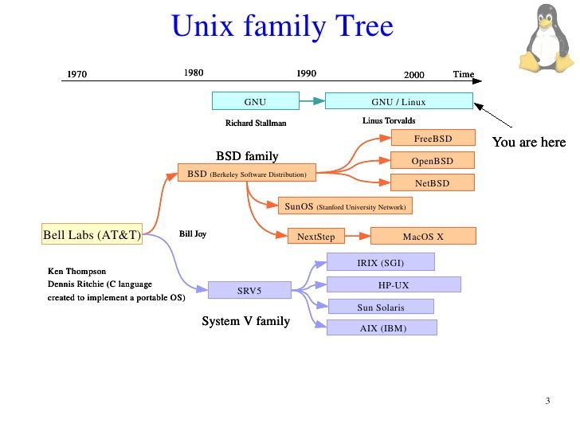
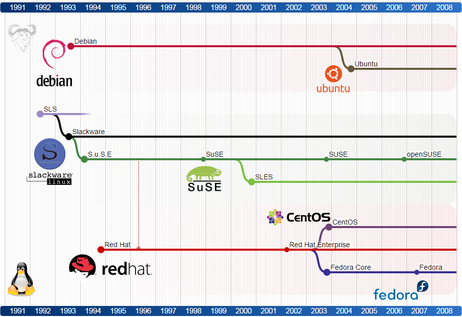
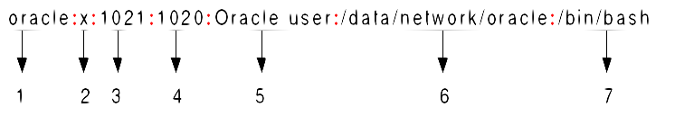
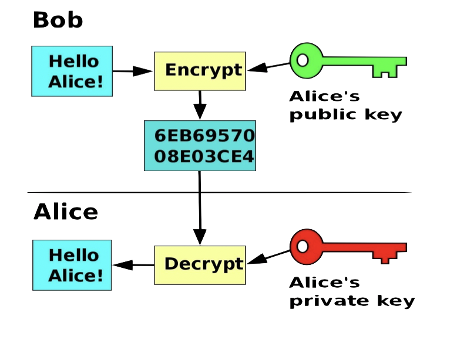

<!-- _class: - gaia -->

# <!--fit--> Linux 2 <br> DEVOPS 2021
## Lektion 1

---

# Presentation: Nevyn Bengtsson
## Bakgrund


* Spelprogrammering, BTH (3-årig utbildning)
* Spotify AB: iPhone-apputveckling
* Lookback Inc.: Grundare, CTO
* Alloverse AB: Grundare, CEO, CTO 
* Kört Unix sedan garderobsserver på 90-talet

---

# Presentation: Nevyn Bengtsson
## Utbildningserfarenhet

* CoderDojo, MobileBridge, hobbyistlärare
* Detta är mitt första betalda lärarjobb -- var snälla 😅 
* Frågor till/om mig?

---

# Installera Linux

* USB-minnen finns här framme
* Ubuntu 20.04 LTS, men välj eget om ni vill
* Annat än Debian-baserat blir jobbigt, men funkar (ni får anpassa)

---

# Presentation: Vilka är ni? :)


---

#  Om kursen
* Fortsättning på Linux 1
* Shell scripts, filer, installationer, paket, nätverk, virtuella miljöer
* Server-fokus, kommandorad
* Alla förväntas ha en egen Linux-installation att labba med
* Exempel är mestadels på Ubuntu

## Låt oss kolla kursplanen!

---

# Om kursen
## Undervisning på plats
Måndag, onsdag, torsdag

## Examination i två delar
 * Gruppuppgift
 * Skriftlig tentamen

---

# Om kursen

## Förmiddag
Genomgångar med pauser och korta övningar. Övningarna både i grupp och var för sig.

## Eftermiddag
Någon genomgång med övning (oftast), repetition, tid att jobba ihop

---

# Om kursen

## Tider

0900—1530

(Om jag kan gå en halvtimme tidigt så kan jag svara på frågor en stund på kvällen)


---

<!-- _class: - gaia - lead -->

# <!--fit--> Dagens kurs

---

# Dagens kurs

* Repetion allmänt om Linux
* Repetition om användare
* Repetition / bli varm igen grunderna för shell scripts
* Genomgång av gruppuppgiften

---



_(Bild: FOSS History)_

---



&nbsp;&nbsp;&nbsp;&nbsp;&nbsp;&nbsp;&nbsp;&nbsp;&nbsp;&nbsp;&nbsp;&nbsp;&nbsp;&nbsp;&nbsp;&nbsp;_(Bild: Cognitive Waves)_

---

# Unix-/Linux-principer


* "Do one thing well": Specialiserade program för att göra små, väldefinerade saker
* "Write programs to work together": sätt ihop enkla program för att åstadkomma större saker:
    * `ls -l | grep test`
* Allt är filer
* Allt kan anpassas

ps. glöm inte `man`! 

---

<style scoped>
li {
  font-size: 30px;
}
</style>

<!-- _class: - invert - lead -->

# <!--fit--> Användare

---

# Användare 

* Loggar in
* Användarnamn, lösenord 
* `whoami`
* `/etc/passwd`
* `/etc/shadow`

---

# Övning 1

Uppvärmningsövning:
1. Logga på din Linux-installation
2. Se ditt användarnamn med whoami
3. Hitta dig själv i `/etc/passwd` (kommer ni ihåg grep?)
4. Hitta dig själv i `/etc/shadow` (här behöver du se till att ha rättigheter att läsa den)
---

#  Övning 1

```shell
$ grep mo /etc/passwd
nevyn:x:1000:1000:nevyn Bengtsson:/home/nevyn:/bin/fish
$ sudo grep nevyn /etc/shadow
nevyn: $6$GKKkA67j$EgFKNA904ycLM.LwVIMcFEjmYpef4ohkw.
nCHecAGrnk4EeoD05VY690NqgL95LjR0Tz5wyq4NddQvi
H1mOnI1:16190:0:99999:7:::
```

---

<style scoped>
li {
  font-size: 18px;
}
</style>

# `/etc/passwd`



1. Username
2. Password:
3. User ID (UID)
4. Group ID (GID)
5. User ID Info
6. Home directory
7. Command/shell

Bild från www.cyberciti.biz

---

# Lägg till användare
 
* `sudo adduser <username>` -- skapa användare och hem-mapp
* `sudo useradd <username>` -- ⚠️ skapar inte hem-mapp, etc!
* `sudo passwd <username>` -- byt lösenord på egen ELLER ANNAN användare

---

# Användargrupper

* `/etc/group`
* En användare har en primär grupp och noll eller fler sekundära grupper

```shell
$ sudo useradd -a -G <groupname> <username>
$ sudo useradd -g <groupname> <username> 
$ sudo groupadd <groupname>
```

---

# Övning 2

* Titta i `/etc/group`
* Hitta alla grupper som din användare tillhör

---

# Övning 3

* Nu gör vi ett litet script! Kom ihåg: `#!/bin/bash` och `chmod a+x mittscript.sh` och `./mittscript.sh`.
* Gör ett script `usercheck.sh` som tar en inparameter och letar efter denna som användarnamn i `/etc/passwd` och `/etc/group`, samt skriver ut de raderna
    * Användning exempel: `$ usercheck.sh nevyn`
    * Det får vara grovt och hitta även andra rader än de man är ute efter


---

# Övning 3

```bash
#!/bin/bash
# simple example script
# usage: usercheck.sh <username>

user=$1
echo "from passwd:"
grep $user /etc/passwd
echo "from group:"
grep $user /etc/group
```

--- 

# Superhjältar... ehum, -användare

* Root
* Sudo
* Testa:
    * `sudo whoami`
* Sudoers och sudo group
    * `/etc/sudoers`

---

# Superanvändare

Ge sudo-rättigheter:

```shell
usermod -a -G sudo <username>
usermod -aG sudo <username> # betyder samma sak
```

Alternativt editera /etc/sudoers direkt _(ej rekommenderat, använd /etc/sudoers.d/ och skapa filer som ger rättighter)_:

```shell
visudo
```

---

#  Köra som annan användare

(Framförallt för att bli root, men funkar även med andra användare)

```bash
su <username>    # behåll environment
su - <username>  # nollställ environment
```

---

# Övning 4

* Skapa en ny användare
* Observera vad den användaren får för grupptillhörighet per default
* Lägg till användaren i gruppen sudo
* Testa så du kan göra “su” till den användaren och sedan köra något som sudo (t ex sudo whoami)

---

```bash
nevyn@nevyn-linux2:~$ sudo adduser nev4
Adding user `nev4' ...
Adding new group `nev4' (1004) ...
Adding new user `nev4' (1004) with group `nev4' ...
Creating home directory `/home/nev4' ...
Copying files from `/etc/skel' ...
New password: 
Retype new password: 
passwd: password updated successfully
Changing the user information for nev4
Enter the new value, or press ENTER for the default
	Full Name []: 
	...
Is the information correct? [Y/n] 
nevyn@nevyn-linux2:~$ grep nev4 /etc/group
nev4:x:1004:
nevyn@nevyn-linux2:~$ grep nev4 /etc/passwd
nev4:x:1004:1004:,,,:/home/nev4:/bin/bash
nevyn@nevyn-linux2:~$ sudo usermod -aG sudo nev4
nevyn@nevyn-linux2:~$ su nev4
Password: 
nev4@nevyn-linux2:/home/nevyn$ sudo ls
[sudo] password for nev4: 
Desktop  Documents  Music     Public  Templates
Dev	 Downloads  Pictures  snap    Videos
```

---

<style scoped>
li {
  font-size: 30px;
}
</style>

<!-- _class: - invert - lead -->

# <!--fit--> ssh

---

# ssh

* ssh (secure shell) – protokoll för att kommunicera med dator, oftast över nätverk
    * Om du inte har sshd igång, installera och starta den!
    * `sudo apt install openssh-server`
    * `systemctl start sshd`
    * Testa: `ssh localhost`
* ”Secure Shell (SSH) is a cryptographic network protocol for operating network services securely over an unsecured network. Typical applications include remote command-line, login, and remote command execution, but any network service can be secured with SSH.” (en.wikipedia.org)

---
# ssh

* Använder sig av publik nyckel-kryptering
* PKI: _Public Key Infrastructure_



---
# ssh

* Använder sig av publik nyckel-kryptering
* `ssh-keygen` för att skapa nyckelpar (rsa är standard)
    *  Utöver RSA finns: DSA, ECDSA, Ed25519 
* Defaultport 22

---
# ssh

* `man ssh` för att hitta diverse varianter
    *  Exempel: `ssh <server> -p <port> -l <login>`
* Två olika sätt att logga in:
    * Lösenord (inte rekommenderat)
    * Login med privat nyckel som matchar den som finns på servern (rekommenderat)
* `~/.ssh/authorized_keys`

---

<!-- _class: - invert - lead -->

# <!--fit--> Script-repetition

---

# Script-repetition

* bash
* Ge värde till en variabel: var=10
* Använd variabelvärdet: $var

Exempel:
```bash
var=10
echo $var
```

---
# Script-repetition

<style scoped>
li {
  font-size: 30px;
}
</style>

* Aritmetik
    * Variabler behandlas som strängar, men man kan räkna genom användning av dubbelparanteser
    * Exempel: `sum=$((var*2))`
* for-loop: `for <var> in <list>`
    * Kan också vara en räknare med heltal
    * Exempel: ``` for name in `ls` ```
    * Exempel: `for i in {1..5}`
* for-do-done

---
# Övning 5
* Gör ett skript som skriver ut multiplikationstabellen 1 till 10
* Använd for-loopar

---
# Övning 5

```bash
#!/bin/bash
# simple multiplication tables
for i in {1..10}
do
    for j in {1..10}
    do
        res=$((i*j))
        echo $i "*" $j "=" $res
    done
done
```

---
# Script-repetition

* Villkor:
    * `=` or `==` is equal to
    * `!=` is not equal to
    * `<` is less than in ASCII alphabetical order
    * `>` is greater than in ASCII alphabetical order
    * `-z` test that the string is empty (null)
    * `-n` test that a string is not null
* Exempel: `[ $a > $b ]`

---

# Script-repetition

* if – then – else
* if [villkor] then /.../ fi
* Notera att villkor kan vara av väldigt olika slag

---

# Övning 6

Lägg till i scriptet från övning 5 att när de två tal som multipliceras är lika, skriver det ”hej”

---

# Övning 6

```bash
#!/bin/bash
# simple multiplication tables

for i in {1..10}
do
    for j in {1..10}
    do
        res=$((i*j))
        echo $i "*" $j "=" $res
        if [ $i == $j ]
        then
            echo "hej"
        fi
    done
done
```

---

# Script-repetition

* Använd externt verktyg: ``` `ls` ``` eller `$(ls)`

```bash
for file in `ls`
do
    echo "En fil: $file"
done
```

---

 Tillbakablick, reflektion, kommentarer ... ... sedan skall vi prata om gruppuppgiften.

---

<!-- _class: - invert - lead -->

# <!--fit--> Gruppuppgift

---
# Gruppuppgiften

* Uppgiften utförs i grupp, helst 3-4 personer
* Att genomföra uppgiften är ett krav för godkänd kurs
* De som gör en godkänd redovisning på någon av de avsatta tiderna sista kursveckan får dessutom 2 bonuspoäng på tentan
    * Sikta på att redovisa onsdag 14/9!
    * Reservtider för redovisning torsdag 15/9

---

# Gruppuppgift

* Scenario: Ni skall bygga upp miljöer för både utveckling / test och drift av en enkel applikation
    * Operativsystemet är Linux
    * Applikationskoden kommer hanteras i git
    * Miljöerna kräver apache webserver och MySQL
    * Ni får själva uppfinna / anta vad som kan behövas för övrigt
* Ni skall göra ett förslag till hur miljöerna skall byggas och hur driftsättning från test skall gå till

---
# Gruppuppgift

* Ni skall visa hur ni hanterar användare i respektive miljö
* Driftsättning bör automatiseras i rimlig mån
* Ni skall lägga upp någon form av övervakning av väsentliga program i drift
* Det finns många sätt att lösa den här uppgiften – alla fungerande sätt blir godkända

---
# Gruppuppgift

* Redovisningen skall presentera resonemang om hur ni valt era miljöer och varför
* Redovisningen skall innehålla ett element av riskanalys
* Redovisningen skall visa en demo av hur ni byggt miljöerna
* Redovisningen bör ta 10-15 minuter per grupp
