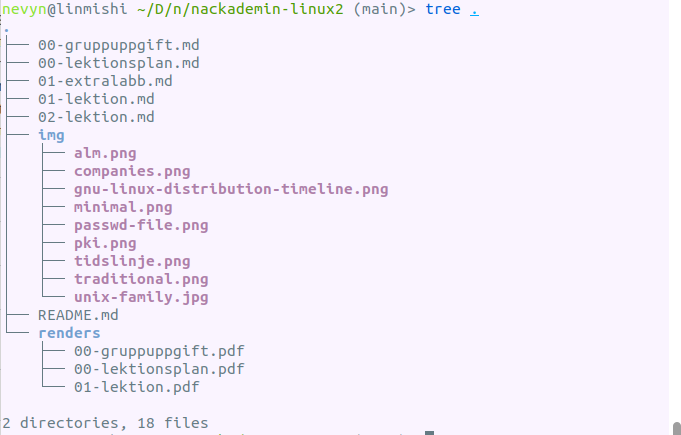

<!-- _class: - gaia -->

# <!--fit--> Linux 2 <br> DEVOPS 2021 
## Lektion 2

---

# Uppvärmning
* Kommentarer / önskemål efter första dagen?
* Skicka förslag på grupper till grupparbetet denna veckan

---

# Idag 

* Allmänt om server, uppbyggnad
* Miljöer för utveckling, test och drift 
* Repetition: Filer och filrättigheter 
* Filöverföringar – om ftp, scp etc 
* NFS, olika typer av filsystem

---
<!-- _class: - invert - gaia - lead -->

# <!--fit--> Miljöer och uppbyggnad

---
<!-- _class: - invert - lead -->

# <!--fit--> Hur passar en server in

---

# Linux-server

* Behöver först och främst veta vad just denna server är till för
* Använder sällan annat än kommandorad
* Fysiska och virtuella servrar

---

# Applikationens livscykel


---

# Tidslinje för ett system


---
<!-- _class: - invert - lead -->

# <!--fit--> Miljöer

---

# Traditionell uppsättning miljöer


---

# Mer minimalistisk (och vanligare) 


---

# Dev-miljö ("utveckling")

* Har utvecklingsverktyg (debugger, profilering, etc)
* Koppling till versionshantering (commit -> deploy)
* Test-data i databas
* Oftast på privat internt nätverk

---

# Test-miljö

* Har testverktyg (profilering, automat-testning, UI-tester, etc)
* Har ofta även utvecklingsverktyg
* Också test-data
* Oftat också på privat internt nätverk

---

# Prod-miljö ("drift", "produktion")

* Bara drift-verktyg, dvs inga utvecklings- eller testverktyg
* Äkta data ("prod-databas")
* Regelbunden backup
* Redundans: flera servrar för ökad driftssäkerhet
* Tillgång endast för administratörer (eller helst ingen access alls!)

---

<!-- _class: - invert - lead -->

# <!--fit--> Regler och konfiguration

---

# Allmäna regler

* Ha inte saker installerade som inte behövs på Servrar – ha mindsetet “less is more”
* Koll på användare / vem som har tillgång till miljöerna
* Resursplanering utifrån serverns funktion

---

# Att ha koll på

* Vilka program / paket behövs för det som skall finnas på servern?
* Vilka portar behöver vara öppna? 
* Var i nätverket skall servern vara? 
* Vilka skall ha tillgång till den?
* Vad för övervakning behövs? 
* Vilka backuper behövs?

---

# Övning 1


Antag att ditt team utvecklar en Java- applikation med webbinterface, användardata i en MySQL-databas, samt ett antal informationsfiler som kan laddas ned från webben.

## Vad behöver ni på en utvecklingsserver respektive på en driftsserver? Fundera på alla verktyg som kan behövas.

---

<!-- _class: - invert - gaia - lead -->

# <!--fit--> Filer och filsystem

---

# Filer

* En Unix-princip är att allt är filer
* Filer har en ägare och rättigheter sätts på
nivåerna ägare, grupp, övriga ("världen")
* Filen har förstås en typ / ett format – till skillnad
från i en del andra miljöer är det inte hårt
kopplat till någonting i filens namn
   * `file <filename>` gissar vad det är för sorts fil
* Verktyg för att hitta och hantera filer

---

<!-- _class: - invert - lead -->

# <!--fit--> Filrättigheter

---

# Filrättigheter

* Tre set av rättigheter: `|user|group|world|`
* Tre typer av rättigheter: `rwx` (read, write, execute)
* Exempel: `-rwxrwxr-x 1 nevyn nevyn 0 aug 9 19:53 minfil`
* Kan även uttryckas som siffror
   * r = 4, w = 2, x = 1
   * rwx = 4 + 2 + 1 = 7
   * rw- = 4 + 2 = 6
   * `-rwxrw-r--` blir alltså `764`. "allt" blir `777`.

---

# Ändra filrättigheter

* `chown` - byt ägare
   * `chown nevyn minfil`
* `chgrp` - byt grupp
   * `chgrp wheel minfil`
* båda samtidigt
   * `chown nevyn:wheel minfil`

---

# Ändra filrättigheter

* `chmod` - ändra rättigheter
   * `chmod u+rwx minfil`
   * `chmod g-wx minfil`
   * `chmod o+x minfil`
   * `chmod 777 minfil`
---

# Filrättigheter

* Första tecknet då?
   * `-` betyder vanlig fil, e g `-rwxrwxr-x`
   * `d` betyder directory, e g `drwxrwxr-x`
   * `c` betyder "character special", en device, e g `crwxrwxr-x`
* "Sticky bit"
   * Hindrar andra än ägaren från att manipulera filen
   * Exempel: `drwxrwxr-t 2 nevyn nevyn 4096 aug 9 19:58 foobar`
   * `chmod +t <fil>`
---

# Repetition: Kopiera, flytta, etc

<style scoped>
li {
  font-size: 28px;
}
ul {
   float: left;
   width: 500px;
}
</style>


* `cp` – kopiera filer
   * `cp fil1 fil2`
   * `cp -r dir1 dir2`
* `mv` – flytta/döp om filer
   * `mv fil1 fil2`
* `rm` – ta bort filer
   * `rm fil1`
   * `rm -r dir1`

</ul><ul>

* `touch` – markera en fil som läst
   * `touch fil1`
* `mkdir` - skapa mapp
   * `mkdir minmapp`
   * `mkdir -p /var/log/minapp/errors`

---

# Övning 2

* Gör ett directory filexempel, lägg in filer med namnen
test1 ... test10 i det (använd gärna en loop).
* Gör ett script som hittar alla filer i det directory där det
körs som har namn som börjar med test. Låt det
kopiera varje sådan fil till en som har samma namn
med tillägget ”.bak”.
* Testa att köra scriptet som olika användare. Testa
sedan att sätta sticky bit på directory filexempel och
se hur det blir när ni försöker köra scriptet som olika
användare.

---

# Övning 2

```bash
for i in {1..10}
do
   touch test$i
done
```

---

# Övning 2

```bash
#!/bin/bash
for i in `ls test*`
do
   cp $i $i.bak
done
```

---

<!-- _class: - invert - lead -->

# <!--fit--> Skriva, ändra <br>och hitta filer

---

# Skriv till filer

* Skriv över fil1:
   * `echo ”hej” > fil1`
*  Lägg till i slutet av fil1 (append):
   * `echo ”hej” >> fil1`
* Skicka stderr till en fil med `2>`
   * `echo ”hej” >> fil1 2>&1`
*  Input från fil1:
   * `cat < fil1`

---

# Regular expressions-repetition (söka/ersätta)

* Användbart för att hitta strängar och för att byta
ut strängar
* Exempel (från Linux 1):
   * `${arr[*]//rad//foo}`
* Ytterligare verktyg: `sed`
   * Exempel: `cat fil1 | sed 's/abc/ABC/g'`

---

<style scoped>
li {
  font-size: 26px;
}
</style>

# Övning 3

* Skapa en fil fil1 med ett antal namn:
   * Tintin
   * Milou
   * Haddock
   * Kalkyl
   * Dupond
   * Dupont
* Gör ett skript som går igenom filen, byter ut ”Milou” mot
”Milou Hund” och skriver resultatet till en fil fil2.
* Extraövning: Gör nu samma sak på (minst) ett annat sätt.

---

# Övning 3

```bash
#!/bin/bash
while read a
do
   echo ${a//Milou/Milou Hund}
done < fil1 > fil2
```

---

# Använda `sed` istället!

* Som scriptet nyss:
   * `sed 's/Milou/Milou Hund/g' < fil1 > fil2`
* Eller gör ersättningen i samma fil:
   * `sed -i -e 's/Milou/Milou Hund/g' fil1`

---

# Hitta filer

* Find
   * `find {sök i vilken mapp} {sökpredikat och andra uttryck}`
   * `find . -name "*.sh"`
   * `find . -newermt "2022-08-10"`
   * Och till och med saker som `find . -name "*.png" -exec convert {} -resize 64x64 thumbs/{} \;`
* Oändligt med varianter! Se `man find`.

---

# Övning 4

* Gör ett script som hittar alla filer som heter något som slutar på ”sh” (i det directory där scriptet körs plus underdirectories) och som skriver ut resultatet av ett ls -l för de filerna.

---

# Övning 4

```bash
#!/bin/bash
for i in `find . -name "*sh"`
do
   ls -l $i
done
```

---

<!-- _class: - invert - lead -->

# <!--fit--> Överföra filer

---

# Överföra filer: `ftp`, `scp`

* `ftp` - Osäkert (allt i klartext) och krångligt (kontrollkanal och datakanal)
* `scp` - tänk `cp` över `ssh`
   * `scp <from> <to>`
   * `:` betyder "en annan dator", e g `scp lokalfil annandator:distansfil`
   * ladda upp: `scp file <user>@<host>:</some/file>`
   * ladda ner: `scp <user>@<host>:</some/file> <dest>`

---

# Överföra filer: `rsync`, en bättre `scp`

* Bra för backup och nerladdning av kod -- laddar bara upp/ner filer som skiljer sig från den andra datorn!
* `-r` betyder "rekursivt", dvs kopiera allt i mappen. `-a` samma plus behåller modifikations-datum och andra flaggor
* `-z` komprimerar innan överföring: tar mer CPU men sparar bandbredd
* `--delete`: filer raderas remote om de tagits bort lokalt. 
* Exempel:  `rsync -avz --delete ./src serv:/u/src` 

---

# Överföra filer: `sftp`

* `sftp` - tänk `SSL/TLS-säkrad ftp`
   * `sftp remote_user@remote_ip`
* några sftp-kommandon
   * `ls`
   * `cd <dir>`
   * `get <file>`
   * `put <file>`

--- 

# Övning 5

Testa att hämta följande fil med scp respektive med sftp. Använd nedanstående uppgifter (eller kör mot localhost).

```
IP:      maniac.nevyn.nu
Filnamn: message.txt
User:    linux2
Pass:    nackademin
```


Fråga: vad behöver du ha igång på din dator för att scp/sftp skall fungera?


---

# Överföra filer över http och dylikt

* `wget` -- enkel hämtning från främst `http(s)`
   * `wget https://www.dn.se/`
   * `wget -O test.html https://www.dn.se/`
* `curl` -- i princip samma som wget men mycket mer kraftfullt, många olika protokoll och funktioner
   * `curl https://www.dn.se/`
   * `curl -X POST http://www.yourwebsite.com/login/ -d
'username=yourusername&password=yourpassword'`

---

# Övning 6

* Hämta data från `https://www.nackademin.se` med `wget`
* Hämta data från `https://www.nackademin.se` med `curl`
* Kan du logga in i studentportalen med `curl`?

---

# Bonus: `jq`

Tolka och sök i JSON! Extremt användbart, speciellt i kombination med `curl`.

```bash
$ curl -s http://api.open-notify.org/iss-now.json | jq '.iss_position.longitude'
"117.1762"
```

---

<!-- _class: - invert - lead -->

# <!--fit--> Filträd

---

* tree – ett verktyg för att enkelt visualisera filträd
   * `apt install tree`

        

---

# tree

* begränsa hur många nivåer ner den söker sig:
   * `-L <antal>`
* Enbart directories:
   * `-d`
* Skriv ut hela sökvägen
   * `-f`
* Skriv ut filrättigheterna
   * `-p`

---

# Övning 7

* Installera tree (om du inte redan har den).
* Titta på vad som ligger på din Linux-burk genom att göra ett ”träd” från /
   * Tips: Det blir betydligt enklare och tar mindre lång tid om du nöjer dig med att titta på första nivån
* Gör nu samma sak som nyss men med alla filrättigheter utskrivna

---

# Övning 7

* `tree -L 1 /`
* `tree -L 1 -p /`

---

<!-- _class: - invert - lead -->

# <!--fit--> Filsystem

---

* Olika sätt att lagra data. Linux har stöd för över 100 olika filsystemstyper


---

# `mount`

* `mount` gör ett filsystem tillgängligt
   * Tar en "device", e g `/dev/sdb2`
   * Och gör den tillgänglig vid "mount point", dvs ett ställe i ditt existerande filträd (nånstans under `/`)
   * `/mnt` används för temporära mountningar
   * `/media/{nånting}` vanligt för extra hårddiskar
   * kan vara precis varsomhelst, e g `/opt/data`
* `/etc/fstab`

---

# Filsystemstyper: Journaling FS

> A journaling file system is a file system that keeps
> track of changes not yet committed to the file
> system's main part by recording the intentions of
> such changes in a data structure known as a
> "journal", which is usually a circular log. 

_(Wikipedia)_

* Exempel: `Ext4`, `ZFS`, `ReiserFS`

---

# Filsystemstyper: Versioning FS

> A versioning file system is any computer file
> system which allows a computer file to exist in
> several versions at the same time. Thus it is a form
> of revision control. 

_(Wikipedia)_

* Exempel: `NILFS`

---

# Filsystemstyper: Distributed FS

> Distributed file systems do not share block level
> access to the same storage but use a network
> protocol. These are commonly known as network
> file systems, even though they are not the only file
> systems that use the network to send data

_(Wikipedia)_

* Exempel: `NFS`

---

# Filsystemstyper

* Standard i de flexta moderna Linux-system är `ext4`
* macOS använder `apfs` (tidigare `hfs+`)
* Windows använder `ntfs` (tidigare `ext32`, ibland `exfat`)

---

# Mounta external filsystem: NFS

* `mount -t nfs <ip>:<path> <dir>`
* E g: `mount -t nfs 10.0.1.10:/backups /var/backups`

---

Tillbakablick, reflektion, kommentarer ...
