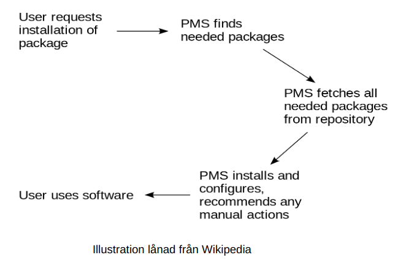
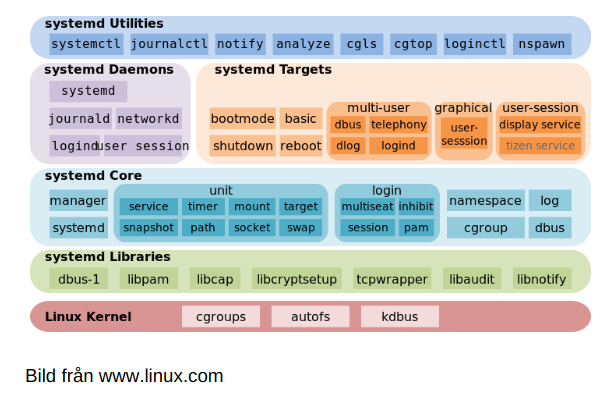
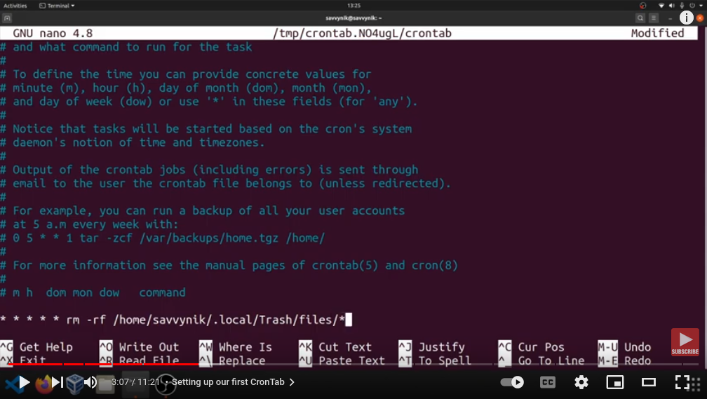

<!-- _class: - gaia -->

# <!--fit--> Linux 2 <br> DEVOPS 2021 
## Lektion 3

---

# Uppvärmning
* Kommentarer / önskemål efter lektion 2?
    * större övningar?
    * övningar i grupp?
* Grupper kommer bestämmas under dagen!

---

# Idag

* Paket och installation med apt / yum
* Installationsexempel: Apache webbserver
* Services – start etc manuellt resp vid boot
* Cron och schemaläggning
* Loggar

--- 
<!-- _class: - invert - lead -->

# <!--fit--> Pakethantering

---

# Standardpaket

* Egen paketering av programversioner för installation sker ofta genom ett deployment- verktyg, t ex Maven eller Jenkins, eller så skapar man paket med sina filer
* Standardpaket installeras oftast med hjälp av pakethanterare som även sköter beroenden

---

# Pakethantering

* Paket innehåller ett program i skick som är enkelt att installera, plus information om beroenden
* Pakethanteraren sköter kontakt med repository, Nedladdning, installation av paket samt även När nyare versioner av paket finns tillgängliga.

---

# Pakethantering



--- 

# Paket

* tar (eller möjligen zip) för mera manuell hantering
* apt (dpkg-paket) för Debian-familjen, bl a Ubuntu
* yum (rpm-paket) för Red Hat-familjen, bl a Fedora

---

# apt

* apt update
* apt upgrade
* apt install <package>
* apt remove <package>
* apt list --installed
* apt list --upgradeable

---

# Övning 1

Uppvärmningsövning! 

Lista alla paket du har installerade på din Linux-
maskin. Se efter vad du känner igen.

---

# Installation

När programmet är installerat är det redo att köra!

Om programmet är en daemon/service/bakgrundsprocess, så måste den det instrueras att starta i bakgrunden mga systemd eller init.d. 

(en daemon/service är något som ska vara igång hela tiden, snarare än något som startas av en användare manuellt när det behövs).

---

<!-- _class: - invert - lead -->

# <!--fit--> Daemoner

# med systemd

--- 

# Daemon

> In multitasking computer operating systems, a
> daemon is a computer program that runs as a
> background process, rather than being under
> the direct control of an interactive user.

_(Wikipedia)_

---

# systemd och systemctl

* systemd är både namnet på ett paket av
program för att initiera och hantera daemoner,
och namnet på en daemon som är central för
den hanteringen
* Det kommando man mestadels använder heter
systemctl

---

# systemd och systemctl



---

# init.d

* Föregångaren till systemd (men används fortfarande)
* `/etc/init.d/`
* `/etc/rc.d/rc.[0-6]`
* `/etc/inittab`

--- 

# systemctl

* Hjälpmedel för att starta deamoner och även
lägga in att de skall startas vid boot
* `/etc/systemd/system/` (dina egna inställningar)
* `/lib/systemd/system/` (från pakethanteraren)

---

# systemctl

* systemctl start <service>
* systemctl status <service>
* systemctl stop <service>
* systemctl restart <service>
* systemctl enable <service>
* systemctl disable <service>
* systemctl is-active <service>

--- 

# systemctl

* systemctl list-dependencies <service>
* systemctl cat <service>
* systemctl show <service>

---

# Övning 2

* Installera webbservern Apache.
    * Paketet heter `apache2`
* Starta tillhörande daemon
* Kontrollera att daemonen är igång
* Ta en titt med `systemctl list-dependencies` `systemctl cat` och `systemctl show`

---

# Exempel: `systemctl cat apache2`


---

# Göra en egen service / daemon

* Först behöver man förstås programmet som skall bli en service
* Skapa en fil för servicen i `/etc/systemd/system/`
    * (eller `/lib/systemd/system/`)
* systemctl daemon-reload
* Nu kan du starta din service

---

# Göra en egen service / daemon


<style scoped>
code {
  font-size: 22px;
}
</style>

Mall från https://www.shubhamdipt.com/blog/how-to-create-a-systemd-service-in-linux/

```
[Unit]
Description=<description about this service>

[Service]
User=<user e.g. root>
WorkingDirectory=<directory_of_script e.g. /root>
ExecStart=<script which needs to be executed>
Restart=always

[Install]
WantedBy=multi-user.target
```

---

# Övning 3

* Skapa ett enkelt program med den enda funktionen att det skriver till en loggfil (välj själv var denna skall ligga) varje gång det startas, med tidsstämpel, och sedan lägger sig i en oändlig loop
* Gör en daemon av detta program – den kan t ex heta simpled
* Starta din daemon, starta om den etc och kontrollera att den skriver till filen du pekat ut och ligger kvar som bakgrundsprocess.

---

# Övning 3

```bash
#!/bin/bash
myfile=/tmp/simpled.log
timestamp=`date +%Y-%m-%d_%H-%M-%S`

echo $timestamp ": started" >> $myfile;

while true
do
    sleep 2
done
```

---

# Övning 3

```
[Unit]
Description=Simple demo service

[Service]
User=niklas
WorkingDirectory=/var/scripts
ExecStart=/var/scripts/simpled
Restart=always

[Install]
WantedBy=multi-user.target
```

---

# Användning av daemoner

* Vad behöver ligga som bakgrundsprocess?
* Vad bör startas automatiskt vid boot?

---

# Övning 4

* Fundera på vad ni tycker är ett typiskt driftscenario med en webbaplikation och i det sammanhanget följande:
    * Vilka program vill man skall ligga som bakgrundsprocesser?
    * På vilka kriterier tycker ni att just de programmen bör ligga som bakgrundsprocesser?


---

<!-- _class: - invert - lead -->

# <!--fit--> crontab

# aka schemaläggning

---

# Daemon kontra schemaläggning

* Program som skall vara igång hela tiden, t ex för att det lyssnar efter förbindelser: daemon
* Program som skall köras regelbundet, automatiskt, men är klart när det är klart: cronjob

---

# Schemaläggning

* crond
* Systemets schemaläggning i `/etc/crontab` och `/etc/cron.d/`
* Användare kan också schemalägga användar-specifika jobb med `crontab`

---

# Schemaläggning med cron



<br><br><br><br><br><br><br>
https://www.youtube.com/watch?v=owLj5Vk_LVI

---

<style scoped>
li {
  font-size: 25px;
}
</style>

# Crontab

`1 2 3 4 5 <cmd>`
* 1: minut (0-59)
* 2: timme (0-23)
* 3: dag av månad (1-31)
* 4: månad av år (1-12)
* 5: dag av vecka (0-7)

```
50 0 * * 1-5    /usr/bin/testscript.sh # 00:50 varje vardag
0  * * * *      /bin/beep              # varje timme
45 2 1 * *      /u/backup.sh           # 02:45 första varje månad
```

---

# Crontab

* För att lägga in jobb i användarens egen crontab:
    `crontab -e`
* Behöver inte ange användare, då jobben körs som ägaren.
* Läsa användarens crontab:
    `crontab -l`
* Ta bort alla cronjob:
    `crontab -r`

---

# Övning 5

* Gör ett script som kontrollerar om daemonen apache2 är igång och skriver resultatet till en loggfil (som du själv väljer) med tidsstämpel.
* Testkör ditt script.
* Lägg in ett cronjob som kör ditt script en gång per minut måndag-fredag varje vecka. Se att din loggfil fylls på.
* När du testat en stund vill du nog ta bort cronjobet igen.

---

# Övning 5

* Script fixar ni vid det här laget
    * Men här är en ledtråd:
    ```if [ `systemctl is-active apache2` == "active" ]```
* Crontab:
    `* * * * 1-5 <script_path>`

--- 
<!-- _class: - invert - lead -->

# <!--fit--> Loggar

---

<style scoped>
li {
  font-size: 25px;
}
</style>

# Loggar: `/var/log`


* `/var/log/syslog` and `/var/log/messages` store all global system activity data, including startup messages. Debian-based systems like Ubuntu store this in `/var/log/syslog`, while Red Hat-based systems like RHEL or CentOS use `/var/log/messages`.
* `/var/log/auth.log` and `/var/log/secure` store all security-related events such as logins, root user actions, and output from pluggable authentication modules (PAM). Ubuntu and Debian use `/var/log/auth.log`, while Red Hat and CentOS use `/var/log/secure`.
* `/var/log/kern.log` stores kernel events, errors, and warning logs, which are particularly helpful for troubleshooting custom kernels.
* `/var/log/cron` stores information about scheduled tasks (cron jobs). Use this data to verify that your cron jobs are running successfully.

_(Från https://www.loggly.com/ultimate-guide/linux-logging-basics/)_

---

# Loggläsning

* `tail -f /var/log/syslog`, kanske tillsammans med grep
* `less` is `more`
* `dmesg`
* Skapa larm när något hänt tillräckligt många gånger (cronjobb till hjälp)
* Titta i specifik logg när något verkar ha gått fel

---

# Loggläsning

`tail /var/log/syslog` exempel:

```
Aug 13 10:08:25 mensaab6 systemd[9783]: Listening on GnuPG
cryptographic agent and passphrase cache.
Aug 13 10:08:25 mensaab6 systemd[9783]: Listening on GnuPG
cryptographic agent and passphrase cache (restricted).
Aug 13 10:08:25 mensaab6 systemd[9783]: Reached target Sockets.
Aug 13 10:08:25 mensaab6 systemd[9783]: Reached target Basic
System.
Aug 13 10:08:25 mensaab6 systemd[9783]: Reached target Default.
Aug 13 10:08:25 mensaab6 systemd[9783]: Startup finished in 71ms.
Aug 13 10:08:25 mensaab6 systemd[1]: Started User Manager for UID
1001.
```

---

# Loggläsning

`dmesg` exempel:

```
[ 13.633925] wlan0: authenticated
[ 13.636666] wlan0: associate with 30:b5:c2:96:44:49 (try 1/3)
[ 13.641591] wlan0: RX AssocResp from 30:b5:c2:96:44:49 (capab=0x411
status=0 aid=2)
[ 13.655527] wlan0: associated
[ 7320.966704] CPU1: Package temperature above threshold, cpu clock throttled
(total events = 1)
[ 7320.966706] CPU5: Package temperature above threshold, cpu clock throttled
(total events = 1)
[ 7320.971681] CPU2: Core temperature/speed normal
[ 7320.971682] CPU3: Package temperature/speed normal
[ 7320.971684] CPU5: Package temperature/speed normal
```

---

# Skriva till loggar

* Vad är intressant att logga?
    * Felsituationer
    * Inloggningar och annat säkerhets-relaterat
    * Nyttjad kapacitet
* Applikationsloggar kan med fördel få egna filer
    * Ta en titt i `/var/log` och dra slutsatser om vilka applikationer som har egna loggfiler

---

# Övning 6

* Ta en titt i /var/log/apache2/
    * Var letar du om du får ett fel i t ex en php-sida på din webbserver?

---

# Intressanta loggar

* /var/log/syslog
* /var/log/boot.log
* /var/log/auth.log
* /var/log/faillog

---

<style scoped>
li {
  font-size: 25px;
}
</style>


# Övning 7

* Bygg följande funktioner:
    * Var 10:e sekund kontrolleras ifall filen `/var/testfil1` ändrats. Om den ändrats skrivs ett radnummer (börja på 1), tidsstämpel och meddelandet att filen har ändrats till en logfil på lämpligt ställe.
    *  Varje gång logfilen innehåller minst 10 rader flyttas innehållet till slutet av en annan fil på lämpligt ställe, en bak-fil, och logfilen är tom tills nästa rad tillkommer.
    * En gång per timme raderas bak-filen.
* Fundera särskilt på om / hur det skall delas upp i flera program, och använd systemctl respektive crontab där det är tillämpligt.

---

```bash
$ cat changelogger.sh
#!/bin/bash
filename=/var/testfil1
logfile=/var/log/mytestd/mytestd.log
rollfile=/var/log/mytestd/mytestd.log.bak
n=1
md1=$(md5sum $filename)

while true
do
    sleep 10
    md2==$(md5sum $filename)
    if [ "$md1" != "$md2" ]
    then
        timestamp=`date +%Y-%m-%d_%H-%M-%S`
        echo $n ": " $timestamp " file changed" >> $logfile
        n=$((n+1))
        if [ `wc -l $logfile | awk '{print $1}'` -ge 10 ]
        then
            cat $logfile >> $rollfile
            truncate -s 0 $logfile
        fi

    fi
    md1=$md2
done
```

---

```
$ crontab -e

# For more information see the manual pages of crontab(5) and cron(8)
# 
# m h  dom mon dow   command
0   *  *   *   *     rm -f /var/log/mytestd/mytestd.log.bak
```

---

```
$ cat /etc/systemd/system/changelogger.service
[Unit]
Description=Logs changes to /var/testfil1

[Service]
User=nevyn
WorkingDirectory=/tmp
ExecStart=/home/nevyn/changelogger.sh
Restart=always

[Install]
WantedBy=multi-user.target

$ sudo systemctl daemon-reload
$ sudo systemctl daemon-reload
```

---


Tillbakablick, reflektion, kommentarer ...
