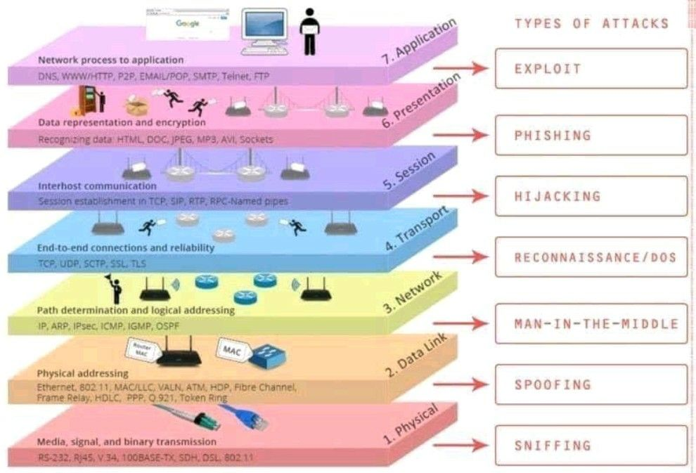
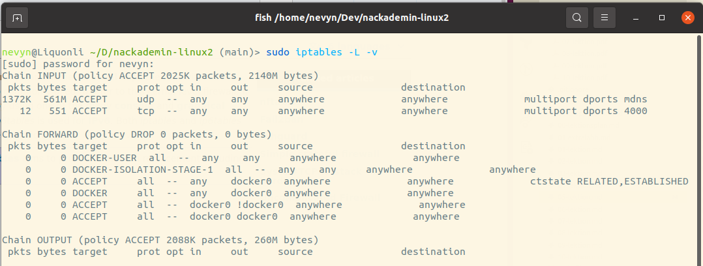
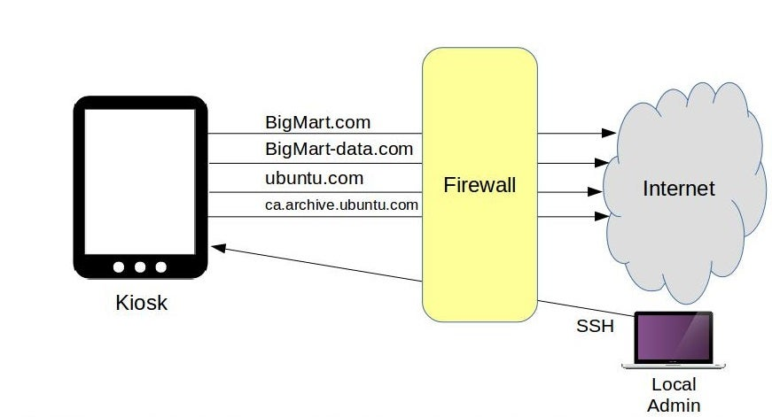

<!-- _class: - gaia -->

# <!--fit--> Linux 2 <br> DEVOPS 2021 
## Lektion 5

---

# Idag

* Säkerhet och nätverkssäkerhet
* Säkerhetstänkande och riskbedömningar på olika nivåer
* iptables
* Härdning
* SSL/TLS

---

<!-- _class: - invert - lead -->

# <!--fit--> Säkerhetstänk

---

# Säkerhet på många nivåer

* Veta vem som skall ha tillgång till vad
* Skalskydd (koll på fysisk tillgång)
* Värdering av tillgångar
* Medvetande och kunskap inom organisationen
* IT-säkerhet

---

# Veta vad man vill skydda och varför

* Vad är värdet?
* Vilka är riskerna?
* Vad är det värt att skydda det här?

---

# IT-säkerhet

* Driftsäkerhet -- att systemen är uppe när de förmodas vara uppe, tillräckligt stabila, etc
* Dataskydd -- att endast behöriga kommer åt uppgifter
* Tillförlitlighet -- att de uppgifter som finns i systemet är korrekta

---



---

# Social engineering

* Tekniska lösningar kan inte avhjälpa mänskliga svagheter
* Vaksamhet på rätt nivå
* Veta vem som får tillgång tillvad

---

# Se realistiskt på de faktiska riskerna


---

# Risker

* Gå igenom riskerna kring ett system
    * Vad kan hända här?
* Värdera
    * Hur troligt är det att det händer?
    * Hur allvarligt är det om det händer?
*  Besluta om åtgärder för att riskerna skall anses vara på acceptabel nivå

---

# Exempel på riskanalys

|Risk|Sannolikhet|Konsekvens|Riskvärde|Åtgärder
|----|-----------|----------|---------|--------
|Skriver fel|5|1|5 (låg)|-
|Datorexplosion|4|5|20 (hög)|Andra datorer
|Sladd ur|2|4|8 (låg)|-

---

# Övning 1

* Hitta så många risker ni kan komma på för genomförande av en kurs på Nackademin
* Värdera riskerna
* Föreslå åtgärder för risker med riskvärde >=10

---

|Risk|Sannolikhet|Konsekvens|Riskvärde|Åtgärder
|----|-----------|----------|---------|--------
|Oklar kursplan|3|4|12|Klargöranden
|Ingen lärare|3|5|15|Säkrad tillgång
|Teknikproblem|4|1|4|-
|Sjuk student|3|4|12|Material på nät
|Inställd lektion|2|2|4|-

---

# Tekniska lösningar på tekniska problem

* Nätverk – vad behöver vara öppet
    * Bra brandväggar
    * Avdelade nätverk
    * Skilja på internt nät och DMZ
* Ordentligt modulär och flerskiktat arkitektur
* Tillräckligt stark autentisering
* Kryptering

---

# Bonus: säkerhet vs UX

* För hög säkerhetsnivå = folk hittar genvägar
    * lösenord på post-its
    * ställer upp den jobbigga dörren)d


---
<!-- _class: - invert - lead -->
# <!--fit--> iptables
---

# Nätverkssäkerhet

* Brandvägg
* Vad ska vara öppet? Vad ska vara stängt?
* Behöver något övervakas?


---

# `iptables`

<!-- https://wiki.archlinux.org/title/iptables#Basic_concepts -->

Linux-program som fungerar som inbyggd brandvägg. Huvudsakligen använt för att filtrera vad som får komma in respektive komma ut. Kan även användas för NAT-routing, och annat.

Grundkoncept:`tables` innehåller `chains` innehåller `rules`.

---

# Övning 2

Se hur din lokala iptables ser ut med `sudo iptables -L -v`.

Lägg speciellt märke till vilka tre chains du ser i defaulttabellen `filter`.

---



---

# iptables: tables
Finns fem fördefinerade tabeller, men vi kommer mest bry oss om tabellen `filter` (den är default)

---

# iptables: chains

En `chain` reglerar _en väg_ för nätverkstrafik: en lista av regler. Tabellen `filter` har tre chains:

* `INPUT`: Paket (förmodligen från nätverket) som ska levereras lokalt.
* `OUTPUT`: Paket som ska från denna datorn och ut till nätverket
* `FORWARD`: Paket utifrån som inte ska levereras lokalt, utan ska ut på nätverket igen (dvs NAT och dyl)

---

## iptables: rules

Varje `rule` består av:

* ett `predicate` (ett test: _OM_ paketet är på port X, eller _OM_ paketet ska till IP Y, osv)
* och en `target` (vad som ska hända: `ACCEPT`, `DROP`, eller flytta paketet till en annan table (överkurs)).

Inom en chain evalueras en lista med regler i tur och ordning. Når man slutet utan att en regel matchats, så utförs antingen `ACCEPT` eller `DROP`, beroende på inställning.

---

# iptables

* Lägg till en regel: `iptables -A {kedja} {regel}`
* Ta bort en regel: `iptables -D {kedja} {regel}`
* Lägg till på specifik plats: `iptables -I {kedja} {plats} {regel}`

---

# iptables

* Tillåt all trafik i en riktning: `iptables -A {INPUT|OUTPUT} ACCEPT`
* Blockera all trafik i en riktning: `iptables -A {INPUT|OUTPUT} DROP`
* Blockera inkommande från specifik IP: `iptables -A INPUT -s 1.2.3.4 -j DROP`

---

<style scoped> td, th { font-size: 20pt; }</style>

|iptables-exempel
|-----------
|Tillåt ssh från specifikt nätverk
|`$ iptables -A INPUT -i eth0 -p tcp -s 192.168.100.0/24 --dport 22 -m state --state NEW,ESTABLISHED -j ACCEPT` `$ iptables -A OUTPUT -o eth0 -p tcp --sport 22 -m state --state ESTABLISHED -j ACCEPT`
|Tillåt all inkommande http
|`$ iptables -A INPUT -i eth0 -p tcp --dport 80 -m state --state NEW,ESTABLISHED -j ACCEPT` `$ iptables -A OUTPUT -o eth0 -p tcp --sport 80 -m state --state ESTABLISHED -j ACCEPT`
|Tillåt forward från ett nätverk till ett annat (ofta internt till externt)|
`$ iptables -A FORWARD -i eth0 -o eth1 -j ACCEPT`
| Rensa tabellen helt
| `iptables -F`

---

<style scoped> td, th { font-size: 22pt; }</style>

|iptables-exempel
|-----------
|Stäng för utgående trafik på http-porten
|`iptables -A OUTPUT -p tcp --dport 80 -j DROP`
|Tillåt trafik ut till specifikt nätverk
|`iptables -A OUTPUT -p tcp -d nackademin.se -j ACCEPT`
| Stäng för all trafik in
|`iptables -P INPUT DROP`
| Stäng för all trafik ut
|`iptables -P OUTPUT DROP`

https://www.thegeekstuff.com/2011/06/iptables-rules-examples/

---

# Övning 3

* Stäng av din egen Linux-maskins tillgång till en webbsite (t ex www.generationt.se) med `iptables`.
* Testa att blockeringen fungerar.
* Ta bort blockeringen igen.

---

# Övning 3

```bash
$ iptables -A OUTPUT -p tcp -d www.generationt.se -j DROP
$ open https://www.generationt.se
$ iptables -D OUTPUT 1
$ open https://www.generationt.se
```

---

# Övning 4

Tänk dig att du gör iptables-konfigurationen för en "kiosk" enligt bilden nedan. Skapa rätt iptables. (om du experimenterar med en dator över teamviewer, se till att hålla öppet för det protokollet!)



---

# Övning 4

```bash
$ iptables -A OUTPUT -p tcp -d bigmart.com -j ACCEPT
$ iptables -A OUTPUT -p tcp -d bigmart-data.com -j ACCEPT
$ iptables -A OUTPUT -p tcp -d ubuntu.com -j ACCEPT
$ iptables -A OUTPUT -p tcp -d ca.archive.ubuntu.com -j ACCEPT
$ iptables -A OUTPUT -p tcp --dport 80 -j DROP
$ iptables -A OUTPUT -p tcp --dport 443 -j DROP
$ iptables -A INPUT -p tcp -s 10.0.3.1 --dport 22 -j ACCEPT
$ iptables -A INPUT -p tcp -s 0.0.0.0/0 --dport 22 -j DROP
```

Övningsexemplet stulet från
https://opensource.com/article/18/9/linux-iptables-firewalld

---

<!-- _class: - invert - lead -->

# <!--fit--> Härdning

---

# Härdning

* Vad skall finnas på just den här servern?
* Vem skall ha tillgång till just den här servern?
* Härdning: Se till att bara det som behöver vara öppet är öppet och att bara den som behöver tillgång får tillgång

 ---

 # Härdning: Allmäna åtgärder


* Gå igenom listan över existerande daemoner / services
    `systemctl list-units --all`
* Gå igenom listan över installerade paket
    `apt list --installed`
* Ingen inloggning som root – använd `sudo` istället
    `sudo passwd -l root`

---

# Övning 5
* Gå igenom listan över existerande services på din maskin. Vilka av dem används idag?
* Gå igenom listan över installerade paket på din maskin. Vilka av dem använder du dig av?

---

<style scoped> li { font-size: 20pt; } </style>

# Härdning: kommunikation
 
* Ha koll på öppna portar (brandvägg eller iptables)
    * `iptables -L`
    * `netstat -a | grep tcp | grep LISTEN`
* Undvik okrypterade protokol: `ftp`, `telnet`, etc. 
    * se till att deras daemons inte är igång/installerade.
    * blockera deras portar
* Om möjligt, undvik att ha några underhållsprotokoll igång: ingen ssh, etc. ("immutable infrastructure")
* Använd krypterade protokoll: https inte http, ssh inte telnet, etc. 
* Stäng av ICMP. Det kommer inte gå att pinga servern = inte lika lätt att hittas av botnets

---

# Övning 6
Gå igenom listan på öppna portar som lyssnar utåt på din maskin. Vet du vilka program de hör till?

---

# Härdning: användare

* Tvinga **INTE** återkommande lösenordsbyten! Det leder till osäkrare system. 
* Lås konto efter ett antal misslyckade inloggningsförsök (använd `pam_tally2` eller skript som tittar i faillog och räknar samt passwd -l för att låsa konto)
* Tillåt endast säkra lösenord (t ex med `libpam-pwquality`)


Läs mer om NISTs senaste rekommendationer: https://www.throttlenet.com/blog/technology-news/nist-password-guidelines-2022-challenging-traditional-password-policies/

---

# Härdning: permissions

* Kör inte daemoner som root eller som din admin-användare. Skapa användare+grupp för varje daemon istället. (e g `apache2` kör som `www`, `mysql` kör som `mysql` osv.)
* Ge dessa användare sedan minimala permissions för att bara göra exakt det de ska
* Ge andra användare access till dessa genom att tilldela grupp (så som `docker` funkar om du tilldelar gruppen `docker`)
* Inga `777`or, inget world-writable

---

# Härdning: bonus

* Kolla upp SELinux, RedHat-standard för kraftfullare säkerhetsinställningar.
* Kör allt i containrar och VMs, så lite som möjligt på fysisk hårdvara
* Uppdatera mjukvara regelbundet, kanske automatiserat eller enligt process
* Var väldigt försiktig med `SUID` och `SGID` (`find / -perm +4000`)
* Finns mycket mer! random artikel: https://www.cyberciti.biz/tips/linux-security.html

---

# Övning 8

* Antag att ni skall härda två Linuxservrar för drift. Nr1 skall användas som webbserver. Nr2 skall användas för en MySQL-databas som nr1 hämtar data från.
* Hur härdar ni respektive server? Gör en åtgärdslista för vardera (och testa gärna konkreta kommandon).

---

# Övning 8

* Gemensamt för båda servrarna:
    * Öppet för ssh-trafik för övervakning / underhåll, i övrigt stängt för inkommande trafik förutom undantag nedan.
    * Minimalt antal användarkonton, enbart individuella konton tillåter inloggning, kontroll av sudo-rättigheter, tvinga säkra lösenord
    * Ingenting igång som inte behöver vara igång.
* Nr1: Öppet för https utifrån.
* Nr2: Öppet för trafik till MySQL (port 3306) från server nr1.


---

<!-- _class: - invert - lead -->

# <!--fit--> SSL/TLS

---
