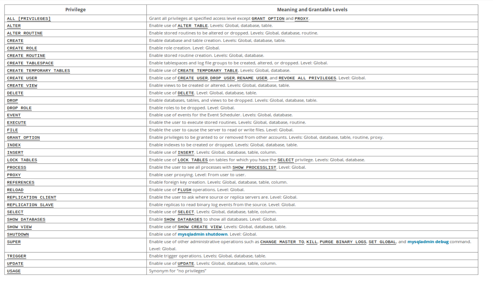

<!-- _class: - gaia -->

# <!--fit--> Linux 2 <br> DEVOPS 2021 
## Lektion 6

---

# Idag

* Databaser
* SQL vs NoSQL
* SQL-exempel: MySQL
* NoSQL-exempel: MongoDB

---

<!-- _class: - invert - lead -->

# <!--fit--> Databaser

---

# Databaser

* Egentligen varje ansamling av data, t ex textdokument
* I sammanhanget menar man oftast relationsdatabaser (SQL-databaser)
* Även andra sätt att organisera data för sökningar (NoSQL-databaser)

---

# Relationsdatabaser

* Data organiserat i tabeller
    * Rader (poster)
    * Kolumner (fält)
* Relationer mellan tabeller
    * Beroenden mellan fält
    * Kräver ett speciellt tänk om man är mer van vid programmering (relationer istället för listor, etc)

---

# Relationsdatabaser - exempel


---

# Relationsdatabaser

* Normalform
    * Se till att data delas upp i tabeller så att det inte upprepas i onödan och så att varje tabell har ett tydligt dataset
* Underlätta snabba sökningar
* Joins av tabeller

---
<!-- _class: - invert - lead -->

# <!--fit--> SQL

---

# SQL

* Urgammalt språk för data-sökningar och hantering av relationsdata
* Sök, lägg in, ändra, radera

---

# SQL: Exempel

| Uppgift | Exempel
|---------|---------
| Sök     | `select * from users;`
| Lägg in | `INSERT INTO users (first_name, last_name, email) VALUES ('Archibald', 'Haddock', 'haddock@moulinsart.be');`
| Ändra   | `update users set email='tintin@moulinsart.be' where first_name='Tintin'`
| Radera  | `delete from users where last_name='Dupont'`

---

# Databasmotor

* Programmet som möjliggör själva databasen
    * Databasfunktioner
    * Användarhantering
    * Lagringshantering
* Exempel (SQL): MySQL, Oracle, MS SQL Server, PostgreSQL
* Exempel (NoSQL): MongoDB, CouchDB, Neo4j

---

<!-- _class: - invert - lead -->

# <!--fit--> MySQL

---

# MySQL

* Relationsdatabaser
* Snabb och anses enkel
* Används ofta för databaser bakom webbsiter
* Open source
* Notera fork: MariaDB

---

# MySQL i praktiken

* `mysqld`
* Data lagras per default i `/var/lib/mysql`
* `/etc/mysql/my.cnf`
    * datadir, etc...
* Defaultport 3306
* Loggar per default till `/var/log/mysql/error.log`

---

# Övning 1

* Installera MySQL (finns i apt) och starta den
    * Paketet heter `mysql-server`
* Kontrollera att du kan gå in i kommandorads-interfacet
    * `sudo mysql` krävs då det inte finns någon användare med lösenord än.
* Ta en titt i `/etc/mysql`, speciellt `my.cnf`

---

# Övning 1

```bash
$ sudo apt install mysql-server
...
$ sudo mysql
nevyn@nevyn-linux2:~/Dev/nackademin-linux2$ sudo mysql
[sudo] password for nevyn: 
Welcome to the MySQL monitor.  Commands end with ; or \g.
Server version: 8.0.30-0ubuntu0.22.04.1 (Ubuntu)

Type 'help;' or '\h' for help. Type '\c' to clear the current input statement.

mysql> create user nevyn identified by "pass123";
Query OK, 0 rows affected (0,04 sec)
```

---

# MySQL: Databaser och användare

Skapa databas:

```sql
CREATE {DATABASE | SCHEMA} [IF NOT EXISTS] db_name [create_option]
```

Skapa användare:

```sql
CREATE USER [IF NOT EXISTS] user [auth_option] [, user [auth_option]] ...
    DEFAULT ROLE role [, role ] ...
    [REQUIRE {NONE | tls_option [[AND] tls_option] ...}]
    [WITH resource_option [resource_option] ...]
    [password_option | lock_option] ...
```

---

# MySQL: databaser och användare

```sql
GRANT priv_type [(column_list)] [, priv_type [(column_list)]] ...
    ON [object_type] priv_level
    TO user [auth_option] [, user [auth_option]] ...
    [REQUIRE {NONE | tls_option [[AND] tls_option] ...}]
    [WITH {GRANT OPTION | resource_option} ...] 
```

---

# MySQL: Exempel

```sql
mysql> CREATE DATABASE mydb;
mysql> CREATE USER myuser1 IDENTIFIED BY "ohemlig";
mysql> GRANT ALL PRIVILEGES ON mydb.* TO 'myuser1';
mysql> GRANT SELECT ON mydb.* TO 'myuser2';
```

---

<style scoped>
    li { font-size: 20pt; }
</style>

# Övning 2

* Skapa en databas `testdb1` på din MySQL-server.
* Skapa en användare `dbuser1` som får fullständiga rättigheter i databasen `testdb1` och även får skapa nya användare där.
* Låt `dbuser1` skapa några testtabeller, använd förslagsvis tidigare bild som din databasdesign. Använd inte `root`/`sudo` i detta steg!


---

# Övning 2

```sql
mysql> CREATE DATABASE testdb1;
mysql> CREATE USER dbuser1 IDENTIFIED BY "losen1";
mysql> GRANT ALL PRIVILEGES ON testdb1.* TO 'dbuser1';
mysql> GRANT CREATE USER ON *.* TO 'dbuser1';
mysql> exit
$ mysql -u dbuser1 -p
```

---

<style scoped>
    code { font-size: 10pt; }
</style>

# Övning 2

```sql
mysql> USE testdb1;
mysql> CREATE TABLE users (
    id int auto_increment primary key,
    first_name varchar(60),
    last_name varchar(80),
    email varchar(50));
mysql> CREATE TABLE movies
    (id int auto_increment primary key,
    name varchar(60),
    description text);
mysql> CREATE TABLE ratings
    (id int auto_increment primary key,
    rating int,
    user_id int,
    movie_id int,
    foreign key (user_id) references users(id), 
    foreign key (movie_id) references movies(id));
mysql> CREATE TABLE tags
    (id int auto_increment primary key,
    tag varchar(40),
    user_id int,
    movie_id int,
    foreign key (user_id) references users(id),
    foreign key (movie_id) references movies(id));
```

---

# Användarrättigheter

* Läsa – select
* Skriva – insert
* Uppdatera – update
* All / ”all privileges”
* Skapa dbs, tabeller etc – create

---



---

# Övning 3

* Lägg nu upp två nya användare, dbuser2 och dbuser3. En av dem skall få skriva och ändra i testdb1, en skall bara få läsa.
* Testa att lägga in data respektive söka data, så att du ser att rättigheterna stämmer.

---

```sql
mysql> create user dbuser2 identified by "losen2";
mysql> create user dbuser3 identified by "losen3";
mysql> grant select, insert, update on testdb1.* to 'dbuser2';
mysql> grant select on testdb1.* to 'dbuser3';
```

---

# Koppla till databas från applikation

* Skapa connection med inloggning, skicka sql, få tillbaka data
* Tänk på att i lämpliga fall sätta upp användare för publik app / webbsite / klient respektive för administration av databasens innehåll!
* Använd prepared statements!! Konkatenera aldrig SQL-strängar med användardata (leder till SQL injection).

---

# Koppla från app: Java-exempel

```java
Class.forName("com.mysql.jdbc.Driver").newInstance();
String connectionUrl = "jdbc:mysql://localhost:3306/testdatabase";
conn = DriverManager.getConnection(connectionUrl, "testuser", "testpass");

String sqlStmt = "SELECT * FROM employees WHERE last_name=? AND first_name LIKE ?";

prepStmt = conn.prepareStatement(sqlStmt);
prepStmt.setString(1, "Doe");
prepStmt.setString(2, "%n%");

rs = prepStmt.executeQuery();
while (rs.next()) {
    String id = rs.getString("id");
    String firstName = rs.getString("first_name");
    String lastName = rs.getString("last_name");
    System.out.println("ID: " + id + ", First Name: " + firstName + ", Last Name: " + lastName);
}
```

---

# SQL injection: exempel (PHP)

```php
$title = $_GET["title"];
mysqli_exec($m, "select * from books where title='".$title."';");
```

Och sen anropar någon sidan med en title = `'; drop table users;--` 

(exempel i form av URL:
`https://example.com/books.php?title=%27%3B+drop+table+users%3B--`)
 och sen har du en riktigt dålig dag.

---

# Mysql: backup aka "dump" av data

* Ta ut data till en fil (t ex för backup eller för att kopiera en databas till en ny server): `mysqldump`
* Skriver per default till stdout, så man behöver även skicka resultatet till en fil.
    `mysqldump -u root -p --databases mydb > dump.sql`
* filen är en lång lista med giltiga SQL-kommandon. "ladda" genom att pipea rakt in i mysql-klienten!
    `mysql -u <user> -p < dump.sq`

---

# Övning 4

* Gör en dump av din databas testdb1 till filen testdb1.sql
* Titta i filen för att se sql-kommandon som återskapar databasen

---

# Övning 4

```bash
$ mysqldump -u dbuser1 -p --databases testdb1 > testdb1.sql
```


---

# Övning 5

*  Tänk er en databas i MySQL avsedd för en webbshop. Den kommer ha många tabeller, men för övningen räcker det med att ni skapar en tabell för produkter.
* Till shoppen hör, förutom webbsite tillgänglig för hela världen, ett admin-interface för dem som får lägga in och ändra data om produkter i databasen.
* Skapa de användare som är lämpliga för att implementera MySQL-delen av detta scenario. Fundera på vad de skall kunna göra, och ge dem rätt rättigheter för det.

---

# Övning 5

```sql
mysql> create database webshop;
mysql> use webshop;
mysql> create table articles (
    id int auto_increment primary key,
    name varchar(40),
    long_name varchar(160),
    description text,
    price decimal,
    category int);
mysql> create user webuser identified by "Aveivdef#1";
mysql> grant select on webshop.* to 'webuser';
mysql> create user admuser identified by "Mealof1bos&p";
mysql> grant select, insert, update, delete on webshop.* to 'admuser';
```

---

<!-- _class: - invert - lead -->

# <!--fit--> NoSQL

---

# NoSQL-databaser

* Inte relationella databaser
* Finns flera olika typer, t ex:
    * Document store
    * Key-value store
    * Graph

---

# NoSQL: Key-Value

> A key–value database, or key–value store, is a data storage paradigm designed for storing, retrieving, and managing associative arrays, and a data structure more commonly known today as a dictionary or hash table.

* Nyckel till dataset, sökningar endast på nyckeln
* Vanligt med data i RAM för snabbhetens skull
* Exempel: dbm, Apache Ignite, **MemcacheDB**, **Redis**

---

# NoSQL: Document store

> A document-oriented database, or document store, is a computer program designed for storing, retrieving and managing document-oriented information, also known as semi-structured data.

* Ett specialfall av key – value
* Dokument i JSON, BSON, XML...
* Kan göra sökningar utifrån dokumentens struktur
* Exempel: MongoDB, CouchDB, DocumentDB

---

# NoSQL: Graph

> In computing, a graph database (GDB) is a database that uses graph structures for semantic queries with nodes, edges, and properties to represent and store data. A key concept of the system is the graph (or edge or relationship).

* Noder och länkar (”edges”) mellan dessa
* Sociala grafer, intressegrafer m fl
* Exempel: Neo4j, TerminusDB, RedisGraph

---

<!-- _class: - invert - lead -->

# <!--fit--> MongoDB

---

# MongoDB

* Dokumentdatabas
* Collections uppbyggda i json
* Inga joins etc!
* Open source

---

# MongoDB i praktiken

* `mongod`
* Data lagras per default i `/var/lib/mongodb`
* `/etc/mongodb.conf`
    * Här finns bl a `dbpath` angivet
* Defaultport `27017`, lokalt webbinterface på `28017`
* Loggar per default till `/var/log/mongodb/mongodb.log`

---

# Övning 6

* Installera MongoDB (det finns paket för apt) och starta den
    * Paketet heter `mongodb`
* Kontrollera att du kan gå in i kommandorads-interfacet)

---

```bash
$ mongo
MongoDB shell version v3.6.8
connecting to: mongodb://127.0.0.1:27017
Implicit session: session { "id" : UUID("bf6b3569-e043-4a0b-8cdb-c48e78373fda") }
MongoDB server version: 3.6.8
Welcome to the MongoDB shell.
For interactive help, type "help".
For more comprehensive documentation, see
	http://docs.mongodb.org/
Questions? Try the support group
	http://groups.google.com/group/mongodb-user
> 

```

---

# MongoDB

* En **databas** skapas så snart man börjar använda den
    `use mydb`
* Skapa **collection** (motsvarar ”tabell” i RDB-- samling av liknande saker)
    `db.createCollection("<name_of_collection>")`
* En collection skapas också så snart man börjar lägga in data
* **Records** (dvs dokument, motsvarar "rader" i RDB) i en collection
* Notera att du inte definerar schema eller vilka fält som är giltiga. Bara att lägga till vad som helst som är giltig JSON.

---

# MongoDB

* Sök data med find
    `db.<collection>.find()`
    `db.<collection>.find( { <villkor> })`
* Stoppa in data med insert
    `db.<collection>.insert( { <data> } )`

---

<style scoped>
    code { font-size: 13pt; }
</style>

# MongoDB exempel

```js
> use testdb
switched to db testdb
> db.mycollection.insert({
    "first_name": "Archibald",
    "last_name": "Haddock",
    "email": "haddock@moulinsart.be"
})
{
  insertedIds: { '0': ObjectId("630f4668ac752c770b3674bf") }
}
> db.mycollection.find()
[
  {
    _id: ObjectId("630f4668ac752c770b3674bf"),
    first_name: 'Archibald',
    last_name: 'Haddock',
    email: 'haddock@moulinsart.be'
  }
]

> db.mycollection.find({ "first_name": "Tintin" })
```

---

# Övning 7

* Skapa en databas testdb i MongoDB.
* Skapa en collection för users med first_name, last_name, email i denna databas och lägg in lite data.

---

# Övning 7

```js
> use testdb
> db.users.insert({
    first_name: "Tintin",
    last_name: "Tintin",
    email: "tintin@moulinsart.be"
})
> db.users.insert({
    first_name: "Milou",
    last_name: "Hund",
    email: "milou@moulinsart.be"
});
```

---

<style scoped>
    code { font-size: 14pt; }
    li { font-size: 18pt; }
</style>

# Användare i MongoDB

* Skapa användare (notera: måste ange roller)
    ```js
    db.createUser({
        user: "<username>",
        pwd: "<pwd>",
        roles: [ { role: "<role>", db: "<dbname>" } ] 
    })
    ```
* Ändra på roller i efterhand med grantRolesToUser
    ```js
    db.grantRolesToUser( "<username>", [ <roles> ] )
    ````

---

# Användare i MongoDB, exempel

```js
> db.createUser({
    user: "testuser1",
    pwd: "losen1",
    roles: [{
        role: "readWrite",
        db:"testdb"
    }]
})
> db.createUser({
    user: "testuser2",
    pwd: "losen1",
    roles: ["readWrite", "dbAdmin", "userAdmin"]
})
```

---

# Övning 8

* Lägg till en användare `muser1` som har **fullständiga** rättigheter i din databas, och en användare `muser2` som endast har **läsrättigheter**.
* Testa att lägga in data respektive söka data, så att du ser att rättigheterna stämmer.

---

# Övning 8

```
> db.createUser( { user: "muser1", pwd: "losen1", roles: [ "readWrite", "dbAdmin", "userAdmin" ] } )
> db.createUser( { user: "muser2", pwd: "losen2", roles: [ "read" ] } )
```

---

# MongoDB: backup/dump av data

* Ta ut data till en binär fil (t ex för backup eller för att kopiera en databas till en ny server): `mongodump`
* Skriver per default ut allt till ett directory dump med underdirectories för respektive databas
* Läs in med `mongorestore`
    `mongorestore <directory>`
* Alternativ  metod som ger dig json, plus mer finkorniga verktyg): `mongoexport` + `mongoimport`. Användbart för att vidareprocessa data, stoppa i annat verktyg, etc... **Använd inte till backup!**

---

# Övning 9

* Gör en dump av din MongoDB-databas
* Titta på de filer som skapas

---

# Övning 9

```bash
$ mongodump
2022-08-31T13:57:31.002+0200	writing admin.system.version to dump/admin/system.version.bson
2022-08-31T13:57:31.005+0200	done dumping admin.system.version (1 document)
2022-08-31T13:57:31.007+0200	writing testdb.mycollection to dump/testdb/mycollection.bson
2022-08-31T13:57:31.008+0200	done dumping testdb.mycollection (1 document)

$ mongoexport --db=testdb --collection=mycollection > mycollection.json
2022-08-31T13:57:10.734+0200	connected to: mongodb://localhost/
2022-08-31T13:57:10.750+0200	exported 1 record

```

---

# MySQL vs MongoDB

* Skillnader i hur man tänker kring databasdesign
    * MySQL (relationsdatabas) i tabeller enligt hur datat förhåller sig till vartannat.
    * MongoDB (dokumentdatabas) i collections där man kan ha nästlat data – men inte slå ihop sökningar av flera collections på en gång. (Men blir ändå relationer -- eg "vilken användare äger denna filen")
* Likheter i mycket kring drift av databaser

---

# Övning 10

* Antag att ni jobbar med både MySQL- och MongoDB-databaser. Ni skall nu göra en checklista för vad man vill ha koll på i drift för dessa.
* Lista saker som skall hanteras för båda typerna
* Lista olikheter i hantering

---

# Övning 10

* Uppsättningar för att se till att rätt saker körs på servern – och att inte onödiga program ligger där.
* Öppna för rätt portar (`3306` för MySQL, `27017` för MongoDB (`28017` för admin-interface))
* Håll koll på loggar (olika loggar, men samma princip)
* Håll koll på när data växer (olika ställen, men samma princip)
* Backupbehov
* Användare i databaser
* Användare på servern

---

# Erfarenheter med MongoDB i praktiken

* Svårt att hantera schema-lös data när den växer till sig. Ansvaret blir ditt som programmerare att se till att rätt data är på rätt plats.
* Väldigt mycket null-checkar
* Ingen statisk typning till hjälp i statiska språk
* Hade hellre använt postgres från början

---

Tillbakablick, reflektion, kommentarer...
