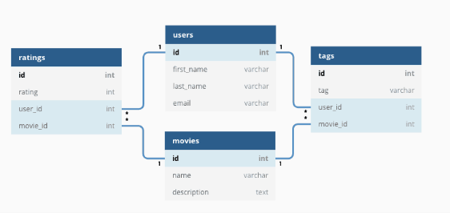

<!-- _class: - gaia -->

# <!--fit--> Linux 2 <br> DEVOPS 2021 
## Lektion 6

---

# Idag

* Databaser
* SQL vs NoSQL
* SQL-exempel: MySQL
* NoSQL-exempel: MongoDB

---

<!-- _class: - invert - lead -->

# <!--fit--> Databaser

---

# Databaser

* Egentligen varje ansamling av data, t ex textdokument
* I sammanhanget menar man oftast relationsdatabaser (SQL-databaser)
* Även andra sätt att organisera data för sökningar (NoSQL-databaser)

---

# Relationsdatabaser

* Data organiserat i tabeller
    * Rader (poster)
    * Kolumner (fält)
* Relationer mellan tabeller
    * Beroenden mellan fält
    * Kräver ett speciellt tänk om man är mer van vid programmering (relationer istället för listor, etc)

---

# Relationsdatabaser - exempel



---

# Relationsdatabaser

* Normalform
    * Se till att data delas upp i tabeller så att det inte upprepas i onödan och så att varje tabell har ett tydligt dataset
* Underlätta snabba sökningar
* Joins av tabeller

---
<!-- _class: - invert - lead -->

# <!--fit--> SQL

---

# SQL

* Urgammalt språk för data-sökningar och hantering av relationsdata
* Sök, lägg in, ändra, radera

---

# SQL: Exempel

| Uppgift | Exempel
|---------|---------
| Sök     | `select * from users;`
| Lägg in | `INSERT INTO users (first_name, last_name, email) VALUES ('Archibald', 'Haddock', 'haddock@moulinsart.be');`
| Ändra   | `update users set email='tintin@moulinsart.be' where first_name='Tintin'`
| Radera  | `delete from users where last_name='Dupont'`

---

# Databasmotor

* Programmet som möjliggör själva databasen
    * Databasfunktioner
    * Användarhantering
    * Lagringshantering
* Exempel (SQL): MySQL, Oracle, MS SQL Server, PostgreSQL
* Exempel (NoSQL): MongoDB, CouchDB, Neo4j

---

<!-- _class: - invert - lead -->

# <!--fit--> MySQL

---

# MySQL

* Relationsdatabaser
* Snabb och anses enkel
* Används ofta för databaser bakom webbsiter
* Open source
* Notera fork: MariaDB

---

# MySQL i praktiken

* `mysqld`
* Data lagras per default i `/var/lib/mysql`
* `/etc/mysql/my.cnf`
    * datadir, etc...
* Defaultport 3306
* Loggar per default till `/var/log/mysql/error.log`

---

# Övning 1

* Installera MySQL (finns i apt) och starta den
    * Paketet heter `mysql-server`
* Kontrollera att du kan gå in i kommandorads-interfacet
* Ta en titt i `/etc/mysql`, speciellt `my.cnf`

---

# Övning 1

// lägg in screenshot

---

# MySQL: Databaser och användare

Skapa databas:

`CREATE {DATABASE | SCHEMA} [IF NOT EXISTS] db_name [create_option`

Skapa användare:

```
CREATE USER [IF NOT EXISTS] user [auth_option] [, user [auth_option]] ...
    DEFAULT ROLE role [, role ] ...
    [REQUIRE {NONE | tls_option [[AND] tls_option] ...}] [WITH resource_option [resource_option] ...] [password_option | lock_option] ...
```

---

# MySQL: databaser och användare

```
GRANT priv_type [(column_list)] [, priv_type [(column_list)]] ...
    ON [object_type] priv_level
    TO user [auth_option] [, user [auth_option]] ...
    [REQUIRE {NONE | tls_option [[AND] tls_option] ...}]
    [WITH {GRANT OPTION | resource_option} ...] 
```

---

# MySQL: Exempel

```
mysql> create database mydb;
   mysql> CREATE USER myuser1 IDENTIFIED BY "ohemlig";
   mysql> GRANT ALL PRIVILEGES ON mydb.* TO 'myuser1';
   mysql> GRANT SELECT ON mydb.* TO 'myuser2';
```

---

# Övning 2

* Skapa en databas testdb1 på din MySQL- server.
* Skapa en användare dbuser1 som får fullständiga rättigheter i databasen testdb1 och även får skapa nya användare där.
* Låt dbuser1 skapa några testtabeller, använd förslagsvis tidigare bild som din databasdesign.

---

# Övning 2

```
mysql> create database testdb1;
mysql> create user dbuser1 identified by "losen1";
mysql> grant all privileges on testdb1.* to 'dbuser1';
mysql> grant create user on *.* to 'dbuser1';
$ mysql -u dbuser1 -p
```

---

# Övning 2

```
mysql> create table users (id int auto_increment primary key, first_name varchar(60), last_name varchar(80), email varchar(50));
mysql> create table movies (id int auto_increment primary key, name varchar(60), description text);
mysql> create table ratings (id int auto_increment primary key, rating int, user_id int, movie_id int, foreign key (user_id) references users(id), foreign key (movie_id) references movies(id));
mysql> create table tags (id int auto_increment primary key, tag varchar(40), user_id int, movie_id int, foreign key (user_id) references users(id), foreign key (movie_id) references movies(id));
```

---

# Användarrättigheter

* Läsa – select
* Skriva – insert
* Uppdatera – update
* All / ”all privileges”
* Skapa dbs, tabeller etc – create

---

// bild på rättigheter

---

# Övning 3

* Lägg nu upp två nya användare, dbuser2 och dbuser3. En av dem skall få skriva och ändra i testdb1, en skall bara få läsa.
* Testa att lägga in data respektive söka data, så att du ser att rättigheterna stämmer.

---

```
mysql> create user dbuser2 identified by "losen2";
mysql> create user dbuser3 identified by "losen3";
mysql> grant select, insert, update on testdb1.* to 'dbuser2';
mysql> grant select on testdb1.* to 'dbuser3';
```

---

# Koppla till databas från applikation

* Skapa connection med inloggning, skicka sql, få tillbaka data
* Tänk på att i lämpliga fall sätta upp användare för publik app / webbsite / klient respektive för administration av databasens innehåll!
* Använd prepared statements!! Konkatenera aldrig SQL-strängar med användardata (leder till SQL injection).

---

# Koppla från app: Java-exempel

---

# SQL injection: exempel

```
    $title = $_GET["title"];
    mysqli_exec($m, "select * from books where title='".$title."';");
```

Och sen anropar någon sidan med en title: `'; drop table users;--` och sen har du en riktigt dålig dag.

---

# Mysql: backup aka "dump" av data

* Ta ut data till en fil (t ex för backup eller för att kopiera en databas till en ny server): `mysqldump`
* Skriver per default till stdout, så man behöver även skicka resultatet till en fil.
    `mysqldump -u root -p --databases mydb > dump.sql`
* filen är en lång lista med giltiga SQL-kommandon. "ladda" genom att pipea rakt in i mysql-klienten!
    `mysql -u <user> -p < dump.sq`

---

# Övning 4

* Gör en dump av din databas testdb1 till filen testdb1.sql
* Titta i filen för att se sql-kommandon som återskapar databasen

---

# Övning 4

`mysqldump -u dbuser1 -p --databases testdb1 >testdb1.sql`

// picture here

---

# Övning 5

*  Tänk er en databas i MySQL avsedd för en webbshop. Den kommer ha många tabeller, men för övningen räcker det med att ni skapar en tabell för produkter.
* Till shoppen hör, förutom webbsite tillgänglig för hela världen, ett admin-interface för dem som får lägga in och ändra data om produkter i databasen.
* Skapa de användare som är lämpliga för att implementera MySQL-delen av detta scenario. Fundera på vad de skall kunna göra, och ge dem rätt rättigheter för det.

---

# Övning 5

```
mysql> create database webshop; mysql> use webshop;
mysql> create table articles (id int auto_increment primary key, name varchar(40), long_name varchar(160), description text, price decimal, category int);
mysql> create user webuser identified by "Aveivdef#1";
mysql> grant select on webshop.* to 'webuser';
mysql> create user admuser identified by "Mealof1bos&p";
mysql> grant select, insert, update, delete on webshop.* to 'admuser';
```

---

<!-- _class: - invert - lead -->

# <!--fit--> NoSQL

---

<!-- _class: - invert - lead -->

# <!--fit--> MongoDB

---

---

# Erfarenheter med MongoDB i praktiken

* Svårt att hantera schema-lös data när den växer till sig. Ansvaret blir ditt som programmerare att se till att rätt data är på rätt plats.
* Väldigt mycket null-checkar
* Ingen statisk typning till hjälp i statiska språk
* Hade hellre använt postgres från början
