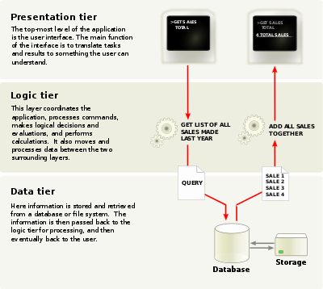
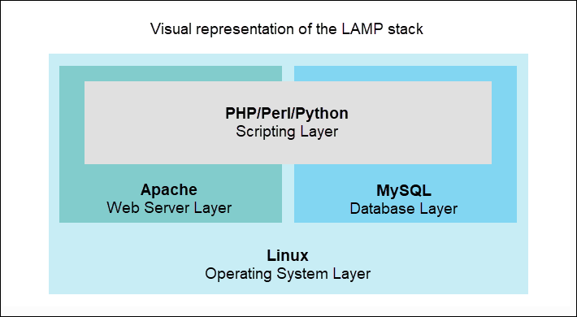

<!-- _class: - gaia -->

# <!--fit--> Linux 2 <br> DEVOPS 2021 
## Lektion 7

---

# Idag

* Installationer och images
* En miljö på en server, eller spridd på flera
* Backup
* LAMP-stack som installationsexempel
* Lite om att skapa ”images”

---

<!-- _class: - invert - lead -->
# <!--fit--> Installationer<br>och servrar

---

# Installationer

* Bygga upp miljö: vid något tillfälle behöver man bygga en hel miljö från scratch med allt som ska med.
* Installationsinstruktion
* "Image" som ett färdigt paket för att installera en server

---

# Image

> ”In the context of files and programs, an "image", whether an ISO or other media image, is simply a file that can be used as an identical copy of the original media. This file not only contains individual data files, but it also contains track and sector information and arranges all this information in a file system, just like disk media. Image files, unlike normal files, are usually not opened; rather, they are mounted.

---

# Installationer

* Servermiljö med standardapplikationer/komponenter
* Deploy av applikation(-er)
* Som vanligt behövs medvetenhet om vad som behövs för utveckling, test, respektive drift

---

# Server / servrar

* IT-arkitektur för drift
* Kompakt system på en server?
* Servrar specialiserade för olika delar?
* Lastbalansering?
* Kringfunktioner, e g mailserver?

---

# Server / servrar

* Anpassa till krav på driftsäkerhet
* Anpassa till ekonomi
* Val av fysiska eller virtuella servrar

---

# Exempel:  3-lagersarkitektur



---

# Övning 1

* Tänk er att ni skall skapa driftsmiljö med ett publikt webbinterface, ett antal moduler skrivna i Java som utför större beräkningar, och data i en relationsdatabas.
* Hur fördelar ni detta på olika servrar? Vad kommer vara viktigt i miljön på respektive server? Vad bör vara öppet och stängt i kommunikationen mellan servrarna?

---

<style scoped>
    li { font-size: 22pt; }
</style>

# Övning 1

* Server 1: Webbserver, med program för detta (t ex Apache) och presentationslogik. Typiskt på DMZ, öppet för http / https utifrån och för ssh från internt nät för administration, samt tillåta trafik in till internt nät till modulerna på server 2.
* Server 2: JVM och beräkningsmodulerna. Typiskt på internt nät. Öppet för trafik till modulerna från server 1 och för trafik till databasen på server 3, samt ssh för administration. Ingen direkt Internet-koppling.
* Server 3: Databasmotor (t ex MySQL), databas med relevant data. Öppen för trafik till databasen från server 2, samt ssh för administration. Alternativt: Databas i databaskluster på servrar för det ändamålet. Ingen direkt Internet-koppling.

---


<!-- _class: - invert - lead -->
# <!--fit--> LAMP

---

# LAMP - Linux Apache MySQL PHP

På detta en databas i MySQL och program i PHP.
* Ibland allt på en server
* Ofta alla PHP-delar på samma maskin som webbservern, men de bör fortfarande hålla en logisk uppdelning mellan presentation och övrig logik.

---

# LAMP



---

# LAMP

* Paket finns att installera med apt för alla komponenter.
* Få dem att fungera ihop
    * PHP körs genom Apache
    * Kopplingar till MySQL i PHP

---

# PHP: Exempel

```php
<pre>
<?php
$conn = new mysqli("localhost", "dbuser1", "losen1", "testdb1");

if ($conn->connect_error) {
	die("Connection failed: " . $conn->connect_error);
}
$sql = "select * from users";
$result = $conn->query($sql);
while($row = $result->fetch_assoc()) {
	print_r($row);
}
?>
</pre>
```

---

# Övning 2

* Installera en LAMP-server: 
    `apt install apache2 mysql-server php libapache2-mod-php php-mysql`
    `systemctl restart apache2`
* Skapa en MySQL-databas med en tabell `users`, stoppa in något data, och gör ett enkelt PHP-exempel som läser från den för att testa.
    * utgå ifrån `mysqlconnect.php`
* Se till att ni kan köra PHP genom Apache och få kontakt med MySQL

---

```sql
$ sudo mysql -uroot
mysql> create database testdb1;
mysql> create user dbuser1@"localhost" identified by "losen1";
mysql> grant all privileges on testdb1.* to dbuser1@'localhost';
mysql> exit
$ mysql -udbuser1 -p
mysql> use testdb1;
mysql> create table users (id int auto_increment primary key,
first_name varchar(60), last_name varchar(80), email varchar(50));
mysql> insert into users (first_name, last_name, email) values
('Archibald', 'Haddock', 'haddock@moulinsart.be');
mysql> exit
$ php ./mysqlconnect.php
...
$ sudo cp mysqlconnect.php /var/www/html/
$ open http://localhost/mysqlconnect.php
```

---

<!-- _class: - invert - lead -->
# <!--fit--> Automatisering

---

# Automatisera installation

* Skript som genomför alla steg i installationen
* Installationsskriptet använder i sin tur sql-skript,php-skript och vad annat det kan behöva
* Målet är att kunna ge ett kommando på kommandorad och veta att installationen görs precis med de steg man har testat ut, i rätt ordning

---

# Övning 3

Gör nu ett script som automatiserar installation av LAMP enligt vad vi gjorde i förra övningen.

---

# Övning 3: Lösning 1/2

```bash
$ mkdir lamp-installer; cd lamp-installer
$ cat > InstallLAMP.sh
#!/bin/bash
apt-get update
apt-get install apache2
apt-get install mysql-server
apt-get install php libapache2-mod-php php-mysql
systemctl restart apache2
mysql <testdb1.sql
cp mysqlconnect.php /var/www/html/
^D
$
```

---

# Övning 3: Lösning 2/2

```sql
$ cat > testdb1.sql
create database if not exists testdb1;
create user dbuser1 identified by "losen1";
grant all privileges on testdb1.* to 'dbuser1';
use testdb1;
create table if not exists users (id int auto_increment
primary key, first_name varchar(60), last_name varchar(80),
email varchar(50));
insert into users (first_name, last_name, email) values
('Archibald', 'Haddock', 'haddock@moulinsart.be');
insert into users (first_name, last_name, email) values
('Karl', 'Kalkyl', 'tournesol@moulinsart.be');
```

---

# LAMP: Avslutningsvis

* Etablerad uppsättning som används på många håll
* LAMP-stacken får konkurrens av t ex JS-baserade MEAN: **MongoDB**, **ExpressJS**, **AngularJS**, och **NodeJS**.
* Som vanligt får man fundera på vad servern skall vara till för.

---

# Övning 4

Tänk er att ni har en LAMP-server för en webbsite där man kan söka fram uppgifter om beslut på en förenings årsmöten genom åren, samt tillhörande databas.

**Gör en riskanalys för driften av denna server.**
* Vad kan hända?
* Hur troligt respektive hur allvarligt är det?
* Åtgärder för de risker som får ett för högt riskvärde

---

<style scoped>
    td, th { font-size: 23pt; }
</style>

|Risk|Sannolikhet|Konsekvens|Riskvärde|Åtgärder
|---|------------|----------|---------|--------
|Förlust av data i db|3|4|12|Backup
|Nätverksproblem (temp)|4|2|8|-
|Server går sönder|2|5|10|Redo att installera ny, alt failover
|Programvara åldras|5|3|15|Se till att uppdatera
|Förlorar LAMP-kompetens|1|5|5|-

---

<!-- _class: - invert - lead -->
# <!--fit--> Backup

---

# Backup: principer (1/2)

* Vad behöver backas upp på vilken server?
* Hur / var lagras backuper?
* Vad är relevant att ha på plats för snabb (om-)installation?

---

# Backup: principer (2/2)

* Det relevanta är återställning. Testa återställning regelbundet.
* 3-2-1-principen
    * 3 exemplar (live + 2 backuper)
    * 2 olika media
    * 1 backup ”offsite”
* Automatisera!! Manuell backup är inte värt en tiondel av en automatisk backup.
    * Finns även en mängd verktyg för att automatisera backuper

---

# Backup: policy

* Vad som skall backas upp och hur ofta
* Var backuper finns
* Vem som har tillgång till backuper
* Ansvar för återställning
* Kryptering av backuper för dataskydd

---

# Övning 5

* Om vi nu tänker på vår LAMP-server, vad är relevant att ta backup på där?

---

# Övning 5: Lösning

* Data från databasen
    * Backup av /var/lib/mysql
    * mysqldump vid särskilt viktiga snapshot-tillfällen eller regelbunden mysqldump (tänk cronjob) och även backup av dessa filer
* Kanske även PHP-program på servern
    * Backup av /var/www/html
    * Eller: håll koll på vilken git-revision?

---

# Övning 6

Implementera nu backup av er MySQL-databas i form av regelbunden dump av data till något lämpligt ställe på disk (låtsas för sakens skull att det är en ansluten extern disk som kommer finnas kvar om databasen kraschar).

Implementera också att mer än 7 dagar gamla dumpar rensas bort automatiskt en gång per dygn. (Tips: `find`)

---

# Övning 6

```bash
$ crontab -e

30 3 * * * mysqldump --databases testdb1 >/opt/backup/testdb1[`date +%Y%m%d`].sql
00 5 * * * find /opt/backup -mtime +7 -exec rm {} \;

```

---

<!-- _class: - invert - lead -->
# <!--fit--> Images
# Med `packer`

---

# Image-verktyg

* Bygga en image med hela servermiljön inkluderad
* Gör det enkelt att snabbt återskapa eller duplicera en miljö
* Exempel: Packer, Vagrant

---

# Packer

> Packer is an open source tool for creating identical machine images for multiple platforms from a single source configuration. Packer is lightweight, runs on every major operating system, and is highly performant, creating machine images for multiple platforms in parallel

---

# Packer

* Gör en image av den maskin den är installerad på
* Konfigureras med det som skall komma med i denna image
* Kan bl a skapa AMI för EC2 (AWS), OVF för VirtualBox, VMX för VMWare
* Används för snabb uppbyggnad av infrastruktur för ett system

---

<!-- _class: - invert - gaia - lead -->
# <!--fit--> Utvärdering

---

# Mitt-i-kursen-utvärdering

* Vad borde vi sluta göra?
* Vad borde vi börja göra?
* Vad fungerar bra?
