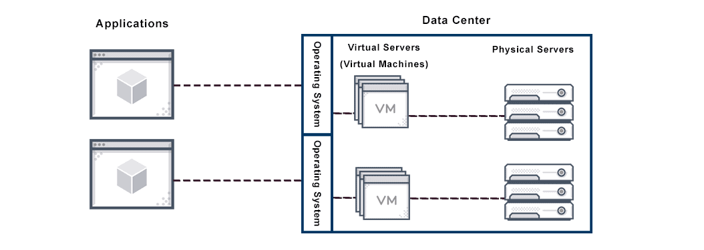

<!-- _class: - gaia -->

# <!--fit--> Linux 2   DEVOPS 2021 
## Lektion 8

---

# Idag

* Virtuella servrar (del 1/2)
* Virtualisering och hypervisors
* Skapa/administrera Linux-VM i molnet (EC2/AWS

)

---

<!-- _class: - invert - lead -->
# <!--fit--> Virtuella 
# <!--fit--> system & maskiner

---

# Allmänt om virtuella system

* Tar bort kopplingen melan "maskin" och hårdvara (eller åtminstone gör den svagare)
* Lätta att skapa och att flytta mellan datorer
* Kan köra på olika sorters hårdvara
* Kan (ofta) köras på olika sorters operativsystem 
    * (linux på linux, linux på mac, windows på linux, ...)

---

# Allmänt om virtuella system

> A virtual machine (VM) is a software program or operating system that not only exhibits the behavior of a separate computer, but is also capable of performing tasks such as running applications and programs like a separate computer. A virtual machine, usually known as a guest is created within another computing environment referred as a "host." Multiple virtual machines can exist within a single host at one time.

-- https://www.techopedia.com/definition/4805/virtual-machine-vm

---

# Övning 1

* Vilka virtuella system (i vid bemärkelse) vet ni om att ni brukar använda?

---

# Övning 1: Några exempel

* VMWare eller annan "kör annat operativsystem på din dator"
* Emulatorer
* En molntjänst man besöker
* Javascript i din webbläsare
* JVM (Java Virtual Machine)

---

# Virtuell server

---

# Virtuell server

* Virtuell server kan flyttas mellan fysiska servrar
* En fysisk server kan ha flera virtuella maskiner/servrar
* Virtuell server kan finnas på en fysisk server du tar hand om, eller i en molntjänst

---

# Virtuell server 

* Flexibilitet
* Skalbarhet
* Tar bort den direkta fysiska kopplingen
    * konfigurera "hårdvara" med config-filer istället för sladdar och prylar
    * Starta om och hantera med kommandon
    * Skala upp och ner

---

<!-- _class: - invert - lead -->
# <!--fit--> Hypervisor

---

# Hypervisor

> A hypervisor (or virtual machine monitor, VMM, virtualizer) is computer software, firmware or hardware that creates and runs virtual machines.

---

# Hypervisor

## Typ 1

Direkt på hårdvaran, dvs hypervisor ÄR operativsystemet. Exempel: **VMWare ESXi**, **Microsoft Hyper-V**, **Xen**

## Typ 2

Ett program som körs inuti ett annat operativsystem, t ex Linux. Exempel: **VirtualBox**, **VMWare Workstation**, ..

---

---

# Virtuella maskiner

* Enkelt att sätta upp en maskin för att testa miljön
* Skapa miljöer med flera maskiner som interagerar
* Användbart för utveckling, test och drift

---

# Använda virtuella servrar ”in house”

* Fortfarande serverpark i egen datahall
*  Minska effekten av enstaka hårdvarufel med virtualisering i flera skikt
*  Utgår från typiska behov av relationsdatabaser, fillagring och applikationer

---

# Scenario

* Vi tänker oss att vi skall bygga upp ett sådant
* ”in house” system med hög grad av virtualisering
*  Databaskluster
* Lagring
* Virtuella servrar för applikationer

---

# Databaskluster

> Clustering, in the context of databases, refers to the ability of several servers or instances to connect to a single database. An instance is the collection of memory and processes that interacts with a database, which is the set of physical files that actually store data.

-- _https://www.techopedia.com/definition/17/clustering-databases_

---

# Databaskluster

* Databashanterare på flera servrar, som kommunicerar med varandra
* Enskilda databaser ”spridda” över klustret, inte hårt kopplade till en viss server
* Feltolerans (inte beroende av en viss server) – ”shared nothing”
* Lastbalansering

---

# Databaskluster

---

# VPS: Virtual Private Server

* I detta scenario en virtuell serverinstans på en lokal hypervisor
* Kan enkelt flyttas till annan hårdvara vid behov
* Får sina resurser tilldelade / konfigurerade
* Tillgång till del av den fysiska serverns resurser
* Eget operativsystem på den virtuella servern

---

# Övning 2

* Tänk dig att ett företag överväger att gå från fysiska servrar till virtuella servrar (”in house”) för drift av en stor e-handelssite med tillhörande logik och relationsdatabaser med data om både varor och kunder.
* Formulera för- och nackdelar med en sådan övergång.

---

# Övning 2, exempel

* Fördelar
    * Minskade hårdvarukostnader på sikt
    * Möjlighet till förbättrad driftsäkerhet
    * Lättare att skala upp vid behov
* Nackdelar
    * En investering i mer hårdvara vid övergången ger högre kostnader momentant
    * Ytterligare en del att administrera i drift

---

# Övning 3

Antag nu att företaget i förra övningen bestämt att ni skall gå vidare och bygga upp ett system av virtuella servrar. Gör en riskanalys för själva övergången från fysiska till virtuella servrar, och föreslå åtgärder för de risker som får ett högt riskvärde

---

# Övning 3

|Risk|Sannolikhet|Konsekvens|Riskvärde|Åtgärder
|----|-----------|----------|---------|--------
|Problem med att kopiera över data|3|5|15|Testa ut en bra rutin
|Förseningar i att bygga upp det virtuella systemet|2|3|6|-
|Program som inte fungerar i den nya miljön|2|5|10|Testa igenom, skriv om vid behov
|Personal inte säker på hur de ska hantera virtuella servrar|3|4|12|Utbildning

---

<!-- _class: - invert - lead -->
# <!--fit--> VM i molnet

---
# Virtuell server i molnet

* Leverantör som tillhandahåller en stor och spridd serverpark bakom de virtuella servrarna.
* Stora aktörer: AWS (Amazon), Azure (Microsoft), Google cloud (Google)

--- 

# Cloud (molntjänster)

* Många servrar i nätver
* Virtuella servrar kan i princip ligga var som helst i detta nät
* Tjänster av olika slag, från en "egen" server till specifika funktioner

---

# Cloud (molntjänster)

> Cloud computing is the on-demand availability of computer system resources, especially data storage (cloud storage) and computing power, without direct active management by the user. The term is generally used to describe data centers available to many users over the Internet.[1] Large clouds, predominant today, often have functions distributed over multiple locations from central servers.

---

<!-- _class: - invert - lead -->
# <!--fit--> AWS & EC2

---*

<!-- _class: - invert - lead -->
# <!--fit--> Virtuella system

