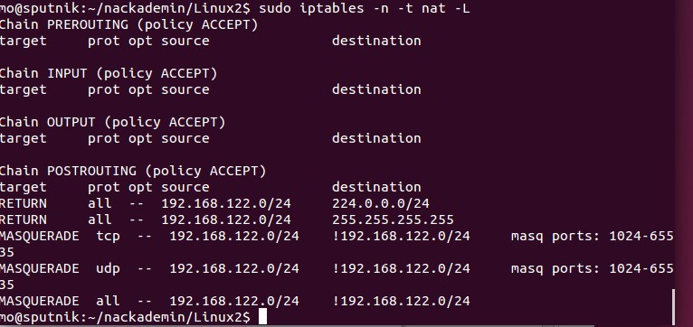

<!-- _class: - gaia -->

# <!--fit--> Linux 2 <br> DEVOPS 2021 
## Lektion 9

---

# Idag

* Virtuella servrar (2/2)
* KVM
* Bygga miljö med virtuella servrar


---

# Virtuella servrar

* Bygga upp ett antal virtuella servrar på en fysisk server
* I princip hela serverparken på en maskin
* En hel testmiljö på en maskin, spridd över olika servrar
* ...eller en av flera fysiska maskiner som används för en uppsättning virtuella servrar

---

<!-- _class: - invert - lead -->
# <!--fit--> KVM 

---

<style scoped>
    blockquote { font-size: 22pt; }
</style>


> ”**KVM** (for **Kernel-based Virtual Machine**) is a full virtualization solution for Linux on x86 hardware containing virtualization extensions (Intel VT or AMD-V). It consists of a loadable kernel module, kvm.ko, that provides the core virtualization infrastructure and a processor specific module, kvm-intel.ko or kvm-amd.ko. 
> 
> Using KVM, one can run multiple virtual machines running unmodified Linux or Windows images. Each virtual machine has private virtualized hardware: a network card, disk, graphics adapter, etc.
> 
> KVM is open source software. The kernel component of KVM is included in mainline Linux, as of 2.6.20. The userspace component of KVM is included in mainline QEMU, as of 1.3.”

----

# KVM

* En hypervisor inbyggd i Linux
* Program på Linux
* I de virtuella maskinerna kan olika operativsystem installeras

---

# KVM


<br><br><br><br><br><br>
Kort introduktion på YouTube:
https://www.youtube.com/watch?v=Pgltb5lnnLY

---


# KVM

* `qemu` för att sköta kontakten med värdmaskinens hårdvara
* `virsh` för kommandoraden
* `virt-manager` för GUI

---

# KVM

* Kvm check
    * Paket `cpu-checker`
    * Kommando `kvm-ok`
* Installera paket
    * `sudo apt-get install qemu-kvm libvirt-daemon-system libvirt-clients bridge-utils virtinst`
* `virsh`

---

# Övning 1

* Kör `kvm-ok`
    * Saknar du det paketet, `apt install cpu-checker`
* Kan din maskin köra KVM?

---

<style scoped>
    li { font-size: 24pt; }
</style>

# Förberedelser

* Om du inte råkar ha någon iso-image liggande på din hårddisk, börja ladda hem en nu så att den finns redo om en stund. (Använd t ex `wget`.)
*  Några relativt små images:
    * CentOS8 minimal http://ftp.lysator.liu.se/pub/CentOS/7.9.2009/isos/x86_64/CentOS-7-x86_64-Minimal-2009.iso
    *  TinyCore http://tinycorelinux.net/11.x/x86/release/Core-current.iso
    * Plain debian https://cdimage.debian.org/debian-cd/current/amd64/iso-cd/debian-11.4.0-amd64-netinst.iso

---

# virsh-kommandon

* `virsh list`
* `virsh list --all`
* `virsh net-list`
* `virsh net-info default`
* `virsh nodeinfo`

---

# KVM-bibliotek

* `/var/lib/libvirt/`
* ISO images: `/var/lib/libvirt/boot/`
* VM-installationer: `/var/lib/libvirt/images/`
* Libvirt-konfiguration: `/etc/libvirt/`

---

# Övning 2

* Installera paketen för att använda KVM
* Se till att `virsh list` ger en (tom) lista
* Se till att `virsh net-list` ger en (tom) lista
* Se nätverksinformation med `virsh net-info default`

---

# Övning 2


---

# Libvirt är en del av andra lösningar också


---

<!-- _class: - invert - lead -->
# KVM
# <!--fit--> Bygg en VM

---

# KVM: bygga en VM

* Börja med att hämta en iso, lämpligen för någon minimerad Linux och kopiera den till `/var/lib/libvirt/boot/`
    ```
    cd /var/lib/libvirt/boot/
    sudo wget http://ftp.lysator.liu.se/pub/CentOS/7.9.2009/isos/x86_64/CentOS-7-x86_64-Minimal-2009.iso
    ```
* Installera med virt-manager (GUI) eller virt-install (CLI)

---

# virt-manager


---

# virt-manager


---

# virt-manager


---

<!-- _class: - invert -->

# virt-manager


---

<!-- _class: - invert -->

# virt-manager


---

<style scoped>
    code { font-size: 16pt;}
</style>

# virt-install, exempel

```bash
sudo virt-install \
    --name centos7 \
    --description "Test VM with CentOS 7" \
    --ram=1024 \
    --vcpus=2 \
    --os-type=Linux \
    --os-variant=rhel7.0 \
    --disk path=/var/lib/libvirt/images/centos7.qcow2,bus=virtio,size=10 \
    --graphics none \
    --location /var/lib/libvirt/boot/CentOS-7-x86_64-Minimal-2009.iso  \
    --network bridge:virbr0 \
    --console pty,target_type=serial \
    -x 'console=ttyS0,115200n8 serial'
```

från https://computingforgeeks.com/virsh-commands-cheatsheet/

---


---

# Fler virsh-kommandon

* `virsh start <vm>`
* `virsh shutdown <vm>`
* `virsh destroy <vm>`
* `virsh reboot <vm>`
* `virsh dominfo <vm>`
* `virsh undefine <vm>`

---

# Övning 3

* Installera en virtuell maskin på KVM.
* Kontrollera att du kan starta och starta om din virtuella maskin.

---

# Övning 3

* `virsh start CentOS7`
* `virsh shutdown CentOS7`
* `virsh start CentOS7`
* `virsh reboot CentOS7`
* `virsh dominfo CentOS7`

---

<!-- _class: - invert - lead -->
# KVM
# <!--fit--> Klona, flytta VM

---

# `virt-clone`

* ”Clone”, skapa en kopia av en virtuell server med `virt-clone`
* Maskinen som skall klonas behöver vara avstängd under kloningen
* Syntax: `virt-clone --original {Domain-Vm-Name-Here} --name {New-Domain-Vm-Name-Here} --auto-clone`

---

# Övning 4

Klona den virtuella maskin som du skapade i övning 3

---

# Övning 4: Lösning


```bash
$ sudo virt-clone --original CentOS7 --name CentOS7-2 –auto-clone
$ virsh start CentOS7-2
```

---

# Kopiera till annan fysisk server

Inte en lika automatisk kloning som lokalt, men med enkla steg:
1. Stäng ned VMen som skall kopieras.
2. Kopiera image-filen från `/var/lib/libvirt/images` på den enba maskinen till den andra
3. Plocka ut vm-definitionerna till en XML-fil som du kopierar till den ny aservern
    `virsh dumpxml VMNAME > domxml.xml`
4. Läs in vm-definitionerna på den nya servern
    `virsh define domxml.xml`

---

<!-- _class: - invert - lead -->
# KVM
# <!--fit--> Nätverk

---

# Nätverk mellan virtuella maskiner

* Default-uppsättning i kvm ger varje virtuell maskin en adress på nätet `192.168.122.0/24`
* Värdmaskinen kan nås på `192.168.122.1` (din VMs gateway)
* Notera att detta gäller för nätverksuppsättningen `hypervisor default`
* Notera NAT-inställningar som har skapats i `iptables`

---

# Övning 5

* Titta på dina virtuella maskiners nätverksinställningar och hitta vilka adresser de har fått
* Testa förbindelsen mellan dina två virtuella maskiner (förslagsvis med `ping`)
* Testa förbindelsen till `192.168.122.1`
* Ta en titt på vad som hänt i `iptables` (på värdmaskinen)
* Ta en titt på nätverksinterface `vibr0` (på värdmaskinen)

---

# Övning 5




---

# Nätverksaccess: NAT


* I `default` så agerar hosten NAT-router, och VMs kan inte nås från världen
* https://wiki.libvirt.org/page/VirtualNetworking

---

# Nätverksaccess: Routed


* I "routed" mode skapar hosten ett nätverk, men utan NAT, så yttre nätverket kan konfigureras så trafik kan nå VMs (men yttre router måste confas)

---

<style scoped>
    li { font-size: 20pt; }
</style>

# Nätverksaccess: Bridged

* Skapa en brygga (bridge) för att göra virtuella maskiner tillgängliga genom nätverket
* Använder sig av värdmaskinens nätverk
* Fungerar inte med wlan
* Skulle kunna `ip link add`... men det är inte persistent
* old-school var `/etc/network/interfaces`, men nuförtiden används netplan
* Outdated men lättläst: https://linuxconfig.org/how-to-use-bridged-networking-with-libvirt-and-kvm
* Modern men svårläst: https://www.answertopia.com/ubuntu/creating-an-ubuntu-kvm-networked-bridge-interface/

---

# Nätverksaccess: Bridged

```yaml
$ networkctl status -a # kolla vad ditt nätverkskort heter
$ pico /etc/netplan/01-network-manager-all.yaml # definera bryggan
network:
  version: 2
  renderer: NetworkManager
  ethernets:
    enp4s0:
      dhcp4: true
  bridges:
    br0:
      interfaces: [enp4s0]
      dhcp4: yes
$ sudo netplan apply # starta om networking
```

---

# Nätverksaccess: Bridged

```bash
$ nmcli con add ifname br0 type bridge con-name br0
# koppla bryggan till fysiska nätverks-kortet
$ nmcli con add type bridge-slave ifname enp4s0 master br0
# byt nätverkskort från fysiska till bryggan
$ nmcli con down netplan-enp4s0
$ nmcli con up br0
# skapa kortet i libvirt
$ cat > bridge.xml
<network>
  <name>br0</name>
  <forward mode="bridge"/>
  <bridge name="br0" />
</network>
```

---

# Nätverksaccess: Bridged

```bash
$ virsh net-define bridge.xml
$ virsh net-start br0
$ virsh net-autostart br0
# ... och sen använd `br0` istället för `default` på din virtuella maskin.
$ virsh edit centos8
    <interface type='network'>
      <mac address='52:54:00:e6:a9:57'/>
      <source bridge='br0'/>
      <model type='virtio'/>
      <address type='pci' domain='0x0000' bus='0x01' slot='0x00' function='0x0'/>
    </interface>


```

---

Tillbakablick, reflektion, kommentarer ...
