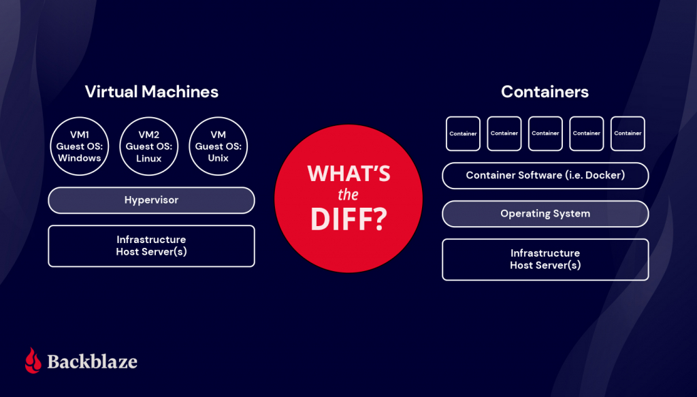
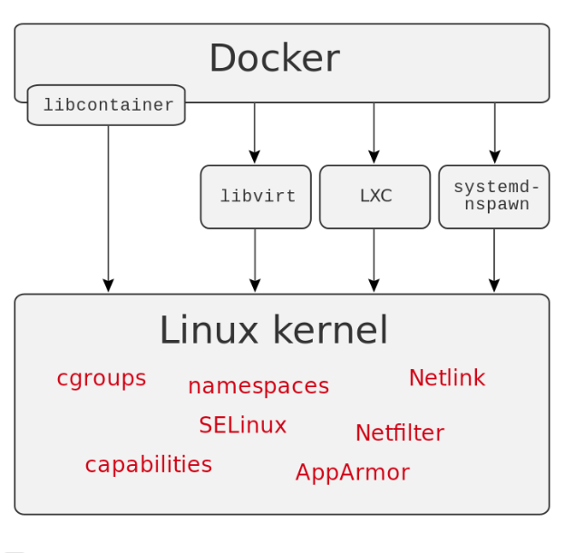

<!-- _class: - gaia -->

# <!--fit--> Linux 2 <br> DEVOPS 2021 
## Lektion 9

---

# Idag

* Andra sätt att virtualisera
* Docker
* Infrastructure as code
    * Ansible
    * Terraform

---

<!-- _class: - invert - lead -->
# <!--fit--> Containers

---

# Containers

* Inte en hel virtuell dator, utan bara en viss miljö i ett virtuellt operativsystem
* Körs på ett operativsystem och delar oftast detta operativsystems kärna, samt bibliotek och en del binärer
* Exempel: Docker, LXC, Solaris Containers

---

# Containers

> Containers may look like real computers from the point of view of programs running in them. A computer program running on an ordinary operating system can see all resources (connected devices, files and folders, network shares, CPU power, quantifiable hardware capabilities) of that computer. However, programs running inside of a container can only see the container's contents and devices assigned to the container.

---



---

<style scoped>
    th, td { font-size: 18pt; }
</style>

# VMs vs containers

| VMs |	Containers
| --- | -----------
| Heavyweight. | Lightweight.
| Limited performance. | Native performance.
| Each VM runs in its own OS. | All containers share the host OS.
| Hardware-level virtualization. | OS virtualization.
| Startup time in minutes. | Startup time in milliseconds.
| Allocates required memory. | Requires less memory space.
| Fully isolated and hence more secure. | Process-level isolation, less secure.
| Can virtualize most things (e g USB) | Can only virtualize fixed set of things

_baserad på tabell från backblaze.com_

---

# Övning 1

* Ni har en fysisk server som ni vill använda till att snabbt sätta upp och köra testmiljöer för er applikation som körs under Linux.
* Lista fördelar med att köra containers respektive virtuella servrar på denna server.

---

# Övning 1, exempel

* Containers:
    * Behöver mindre kraft för varje container än för en virtuell server
    * Går fortare att få igång testkörning för applikationer
    * Kräver mindre minne
* Virtuella servrar:
    * Tillgång till hela operativsystemet
    * Kan ha helt olika operativsystem

---
<!-- _class: - invert - lead -->
# <!--fit--> Docker 
---

# Docker

* Docker container engine
* Kan köra mjukvara i containers
* ”OS level virtualization”
* Containers är fristående och i princip isolerade från varandra
    * Specifik kommunikation mellan containrar kan konfigureras
* Alla containers kör ovanpå din existerande Linux-kernel, men kan ha olika Linux-distribution/userspace

---

# Inuti Docker



* "`chroot` jails"
* "kernel namespaces" för att isolera varje container från andra och från host
* virtuella nätverksinterface
* etc...
* https://www.codementor.io/blog/docker-technology-5x1kilcbow

---

# Installera Docker

* https://docs.docker.com/engine/install/ubuntu/
* https://www.youtube.com/watch?v=Vplj9b0L_1Y

---

# Installera Docker, i korthet:

```bash
$ sudo apt-get update
$ sudo apt-get install ca-certificates curl gnupg lsb-release
$ sudo mkdir -p /etc/apt/keyrings
$ curl -fsSL https://download.docker.com/linux/ubuntu/gpg | sudo gpg --dearmor -o /etc/apt/keyrings/docker.gpg
$ echo \
  "deb [arch=$(dpkg --print-architecture) signed-by=/etc/apt/keyrings/docker.gpg] https://download.docker.com/linux/ubuntu \
  $(lsb_release -cs) stable" | sudo tee /etc/apt/sources.list.d/docker.list > /dev/null
$ sudo apt-get update
$ sudo apt-get install docker-ce docker-ce-cli containerd.io docker-compose-plugin
$ sudo systemctl status docker # kolla så den funkar

$ sudo docker run hello-world

```

---

# Övning 2

* installera docker
* Kör imagen "hello world"
    `docker run hello-world`

---

<style scoped>
    p, li { font-size: 21pt; }
</style>

# Docker-koncept: Images

Som en disk image av en VM, eller ett apt-paket: packeterad mjukvara som går att köra som en enhet. Finns tusentals publicerade under https://hub.docker.com/search. 

Heter ofta `publicerare/produkt:version`. Till exempel `bitnami/redis:7.0` är Bitnamis distribution av Redis, version 7.0.

De flesta images är baserade på en annan: `bitnami/redis` är t ex baserad på `minideb`, minimal Debian.

* `docker image ls`
* `docker image rm` eller `docker rmi`, `docker image prune`
* `docker image pull`, `docker image push`
* etc... `docker help image`

---

# Docker-koncept: Container

Varje gång du kör igång en image så skapas en ny container, dvs en instans av denna image. T ex om du kör igång apache-imagen två gånger så får du två containrar som kör varsin webbserver.

* `docker ps` eller `docker container ls` -- vilka containrar är igång?
* `docker ps -a` vilka finns på systemet, inkl stoppade?
* `docker container attach` -- hoppa in interaktivt i en aktiv container
* `docker kill` -- stäng av en container
* etc... `docker help container`

---

<style scoped>
    p, li { font-size: 19pt; }
</style>


# Docker-koncept: Run

Kör igång en container från en image!

* Interaktivt: `docker run -it bash` -- starta imagen "bash" och kör den:
    * `-i`: interactive, keep stdin open
    * `-t`: allocate a pseudo-TTY (dvs tillåt tangentbords-input)

* Kör med ett kommando: `docker run -t bash echo hello`
* Kör som daemon: `docker run -d -p 80:80 httpd`
    * `-d`: Detach, receive no input nor output
    * `-p cport:hport`: Exponera containers TCP-port till hostens TCP-port 
* Ta bort containern efter körning: `docker run --rm`
* etc... `docker help run`

---

# Övning 3

Använd `bash` i en docker-container och skriv ut "hello world" med echo

---

# Övning 3

```bash
docker run -t bash echo "hello world"
```

---

# Docker, lite viktiga kommandon

* `docker run`
* `docker info`
* `docker ps`
* `docker config`
* `docker container`
* `docker images`
* `docker pull`

---

# Docker

* Förbindelse mellan host och container
* Containernamnet hittar man med `docker ps`
* Kopiera filer till container:
    `docker cp <fil> <container>:<path>`
* Kopiera filer från container:
    `docker cp <container>:<path/fil> <fil>`

---

# Övning 4


---

<!-- _class: - invert - lead -->
# <!--fit--> IaC 

---

---

<!-- _class: - invert - lead -->
# <!--fit--> Ansible 

---

---

<!-- _class: - invert - lead -->
# <!--fit--> Terraform

---

---

Tillbakablick, reflektion, kommentarer ...
